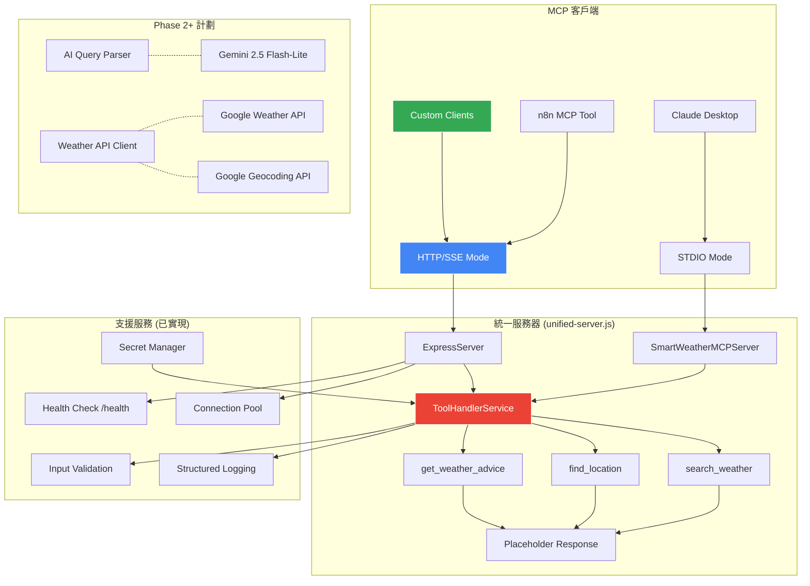
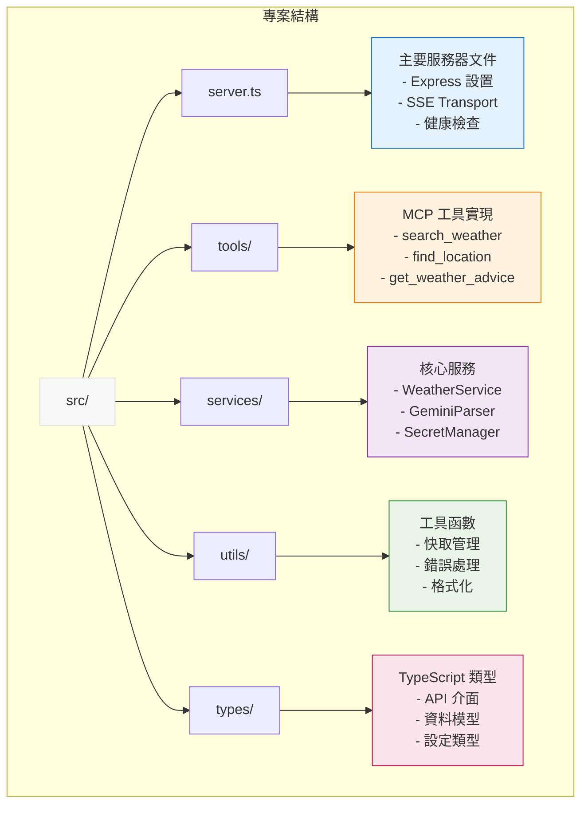

# Smart Weather MCP Server

🌤️ 智能天氣查詢 MCP Server，支援多種傳輸模式部署

## 概述

Smart Weather MCP Server 是一個基於 Model Context Protocol (MCP) 的智能天氣查詢服務，支援 STDIO 和 HTTP/SSE 雙傳輸模式。可部署在 Google Cloud Run 或作為 Claude Desktop 本地工具使用，透過自然語言查詢全球天氣資訊。

**🎯 當前狀態：Phase 1 完成** - 核心基礎架構與 MCP 工具框架已實現，包含完整的雙傳輸模式支援。

### 已實現特性 (Phase 1)

- ✅ **統一傳輸模式**：單一伺服器支援 STDIO 和 HTTP/SSE 模式切換
- ✅ **Claude Desktop 整合**：完美支援 Claude Desktop 本地工具使用
- ✅ **MCP 工具框架**：3個工具完整定義，Phase 1 提供佔位符回應
- ✅ **Cloud Run 支援**：Express 伺服器與健康檢查端點就緒
- ✅ **Google Secret Manager**：安全密鑰管理整合
- ✅ **結構化日誌**：完整的日誌系統與監控支援
- ✅ **連線池管理**：SSE 連線管理與自動清理
- ✅ **輸入驗證**：執行期參數驗證與清理
- ✅ **TypeScript 支援**：完整的型別定義與編譯

### 計劃特性 (Phase 2+)

- 🔄 **AI 智能解析**：Gemini 2.5 Flash-Lite 自然語言理解
- 🔄 **天氣 API 整合**：Google Weather API 與多供應商支援
- 🔄 **多語言支援**：繁體中文、英文、日文
- 🔄 **快取機制**：智能快取與效能最佳化

## 工具清單 (Phase 1 - 佔位符實現)

### 1. search_weather - 智能天氣查詢

**當前狀態**: ✅ MCP 工具框架完成，回傳佔位符回應  
**計劃功能**: 查找任何地點的天氣資訊，智能判斷查詢類型並提供相應的當前、預報或歷史天氣資料

**參數**:
- `query` (必填): 自然語言天氣查詢
- `context` (選填): 額外上下文 (位置、時間範圍、偏好等)

### 2. find_location - 地點發現與確認  

**當前狀態**: ✅ MCP 工具框架完成，回傳佔位符回應  
**計劃功能**: 解決地點位置確認問題，處理模糊地名、提供多個選項、地址標準化

**參數**:
- `query` (必填): 地點搜尋查詢
- `context` (選填): 國家、區域等限制條件

### 3. get_weather_advice - 個人化天氣建議

**當前狀態**: ✅ MCP 工具框架完成，回傳佔位符回應  
**計劃功能**: 基於天氣資訊提供個人化建議和行動指導，幫助用戶做出明智的活動決策

**參數**:
- `query` (必填): 天氣建議請求
- `context` (選填): 活動類型、個人偏好等

## 快速開始

### 前置需求

- Node.js ≥18.0.0
- Docker (選用，用於容器化部署)
- Google Cloud Platform 專案 (選用，用於 Cloud Run 部署)
- gcloud CLI (選用，用於 GCP 部署)

### 本地開發與測試

**Phase 1 實現已可直接使用，提供完整的 MCP 工具框架與佔位符回應。**

```bash
# 1. 安裝依賴
npm install

# 2. 建構專案
npm run build

# 3. 測試基本功能
npm test

# 4a. 啟動 STDIO 模式 (Claude Desktop 整合)
node dist/unified-server.js --mode=stdio

# 4b. 啟動 HTTP 模式 (web 客戶端整合)
node dist/unified-server.js --mode=http --port=8080

# 5. 健康檢查測試
curl http://localhost:8080/health
```

### Cloud Run 部署 (選用)

Phase 1 已支援 Cloud Run 部署，但 API 密鑰為選用：

```bash
# 1. 設定 Google Cloud 專案
export PROJECT_ID=your-project-id
gcloud config set project $PROJECT_ID

# 2. 啟用 API
gcloud services enable run.googleapis.com cloudbuild.googleapis.com

# 3. 建置並部署
gcloud builds submit --tag gcr.io/$PROJECT_ID/smart-weather-mcp
gcloud run deploy smart-weather-mcp \
  --image gcr.io/$PROJECT_ID/smart-weather-mcp \
  --platform managed \
  --region asia-east1 \
  --port 8080 \
  --allow-unauthenticated
```

**注意**: Phase 1 中密鑰驗證在開發環境為選用，部署後可立即測試 MCP 工具框架。

## MCP 客戶端整合

### Claude Desktop 整合 (推薦)

Phase 1 完全支援 Claude Desktop 本地整合，使用 STDIO 模式：

```bash
# 1. 建構專案
npm install && npm run build

# 2. 測試 STDIO 模式
node dist/unified-server.js --mode=stdio
```

Claude Desktop 設定：

```json
{
  "mcpServers": {
    "smart-weather": {
      "command": "node",
      "args": ["/path/to/dist/unified-server.js", "--mode=stdio"]
    }
  }
}
```

### 其他 MCP 客戶端

**HTTP/SSE 模式** (適用於 n8n、自定義客戶端):

```bash
# 啟動 HTTP 模式
node dist/unified-server.js --mode=http --port=8080

# 測試健康檢查
curl http://localhost:8080/health

# SSE 端點
curl http://localhost:8080/sse
```

### Phase 1 使用範例

**當前實現返回佔位符回應，用於測試 MCP 工具框架：**

```json
{
  "name": "search_weather",
  "arguments": {
    "query": "台北今天天氣如何？",
    "context": {
      "location": "台北",
      "preferences": {"units": "celsius", "language": "zh-TW"}
    }
  }
}
```

**Phase 1 回應範例**:
```
Weather search placeholder - Query: "台北今天天氣如何？", Context: {"location":"台北","preferences":{"units":"celsius","language":"zh-TW"}}
```

### API 端點

- **根目錄**: `/` - 服務資訊與可用工具列表
- **健康檢查**: `/health` - Cloud Run 健康檢查端點
- **SSE 端點**: `/sse` - MCP 客戶端連接端點 (HTTP 模式)

## 架構設計

### Phase 1 已實現架構

**雙傳輸模式支援的 MCP 服務架構：**



### 核心組件

- **Express HTTP Server**: Cloud Run HTTP 端點
- **Health Check Endpoint**: `/health` 監控端點
- **SSE Transport Handler**: MCP 協議通信
- **Secret Manager Client**: 安全密鑰管理
- **AI Query Parser**: Gemini 2.5 Flash-Lite 智能解析
- **Memory Cache**: 高效能快取機制

## 監控與維運

### 健康檢查

```bash
curl https://your-service-url/health
```

### 查看日誌

```bash
gcloud logs read --service smart-weather-mcp --region asia-east1
```

### 效能監控

在 Google Cloud Console 中查看 Cloud Run 服務指標。

## 開發指南

### 項目結構



### 測試

```bash
npm test
```

## 文檔

### 核心文檔
- [技術規格](./spec.md) - 詳細技術實現和架構設計
- [產品需求](./prd.md) - 完整產品需求文件
- [執行計劃](./plan.md) - 階段性開發計劃和進度追蹤

### 開發指南
- [傳輸模式說明](./TRANSPORT_MODES.md) - STDIO/HTTP 模式切換指南
- [學習日誌](./LEARNING_LOG.md) - 技術決策和開發經驗記錄
- [開發指引](./CLAUDE.md) - Claude Code 專用開發指南

### 部署相關
- [API 設定指南](./API_SETUP.md) - Google Cloud API 和密鑰設定
- [Docker 設定](./Dockerfile) - 容器化部署配置
- [部署腳本](./deploy.sh) - 自動化部署工具

## 貢獻

歡迎提交 Issue 和 Pull Request！

## 授權

MIT License
