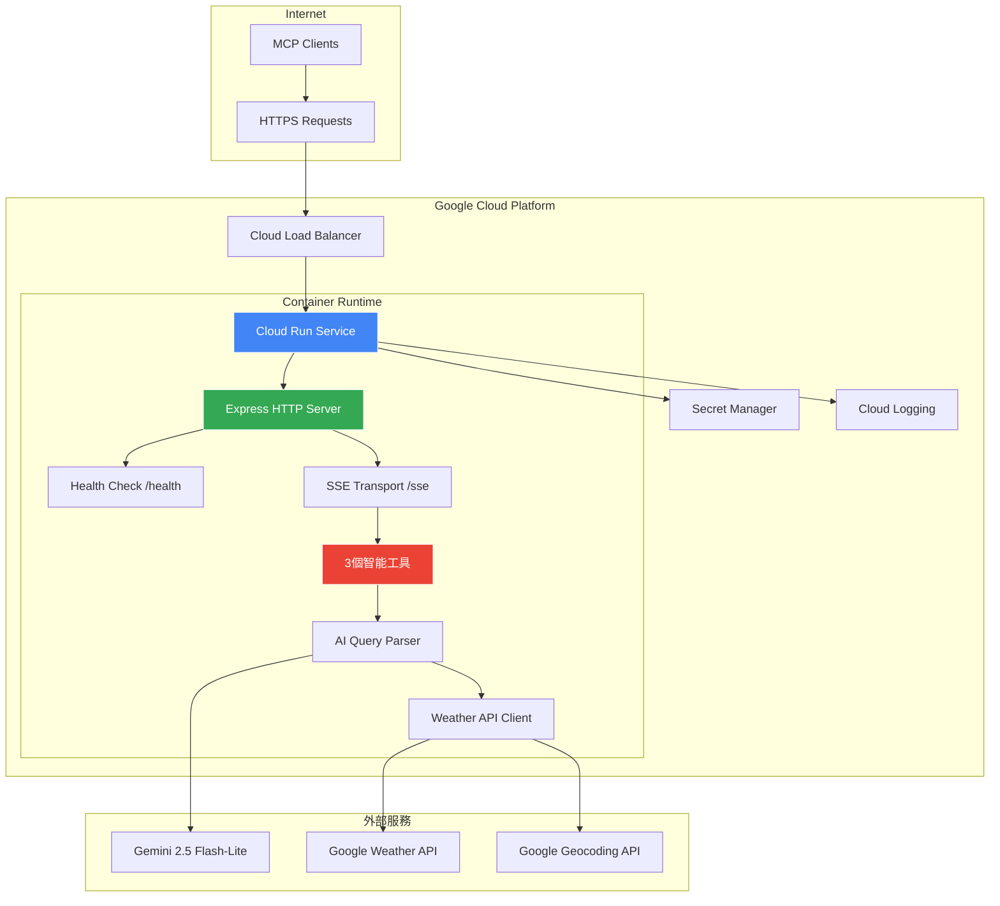
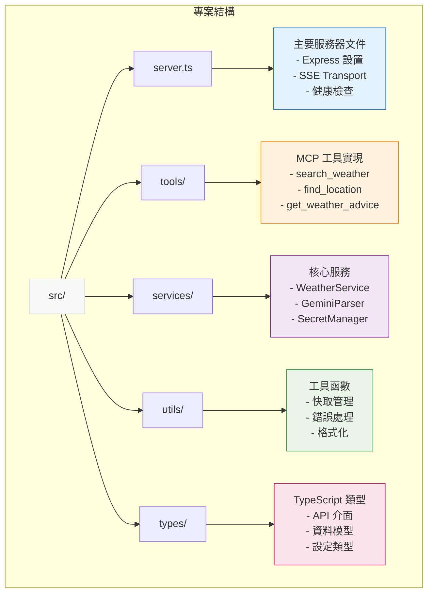

# Smart Weather MCP Server

智能天氣查詢 MCP Server，部署在 Google Cloud Run

## 概述

Smart Weather MCP Server 是一個基於 Model Context Protocol (MCP) 的智能天氣查詢服務，專為 Google Cloud Run 無伺服器環境設計。讓各種 MCP 客戶端（如 n8n、Claude Desktop 等）能夠透過自然語言查詢全球天氣資訊。

### 核心特性

- ☁️ **Cloud Run 部署**：無伺服器架構，自動擴展與按使用量計費
- 🎯 **用戶意圖導向**：3個智能工具涵蓋完整天氣查詢旅程
- 🧠 **AI 智能解析**：使用 Gemini 2.5 Flash-Lite 進行自然語言理解
- 🔐 **安全密鑰管理**：透過 Google Secret Manager 管理 API 密鑰
- 🌐 **HTTP/SSE Transport**：支援遠端 MCP 客戶端連接
- 🌍 **多語言支援**：繁體中文、英文、日文
- 📊 **健康檢查**：內建 Cloud Run 監控端點

## 工具清單

### 1. search_weather - 智能天氣查詢

查找任何地點的天氣資訊，智能判斷查詢類型並提供相應的當前、預報或歷史天氣資料。

### 2. find_location - 地點發現與確認  

解決地點位置確認問題，處理模糊地名、提供多個選項、地址標準化。

### 3. get_weather_advice - 個人化天氣建議

基於天氣資訊提供個人化建議和行動指導，幫助用戶做出明智的活動決策。

## 快速開始

### 前置需求

- Google Cloud Platform 專案
- Docker
- Node.js ≥18.0.0 (本地開發)
- gcloud CLI

### 部署到 Cloud Run

1. **設定 Google Cloud 專案**

```bash
# 設定專案 ID
export PROJECT_ID=your-project-id
gcloud config set project $PROJECT_ID

# 啟用所需的 API
gcloud services enable run.googleapis.com
gcloud services enable secretmanager.googleapis.com
gcloud services enable cloudbuild.googleapis.com
```

2. **建立 Secret Manager 密鑰**

```bash
# 建立密鑰
echo -n "your_weather_api_key" | gcloud secrets create weather-api-key --data-file=-
echo -n "your_geocoding_api_key" | gcloud secrets create geocoding-api-key --data-file=-
echo -n "your_gemini_api_key" | gcloud secrets create gemini-api-key --data-file=-
```

3. **一鍵部署**

```bash
# 執行部署腳本
chmod +x deploy.sh
./deploy.sh $PROJECT_ID asia-east1
```

或手動部署：

```bash
# 建置並部署
gcloud builds submit --tag gcr.io/$PROJECT_ID/smart-weather-mcp
gcloud run deploy smart-weather-mcp \
  --image gcr.io/$PROJECT_ID/smart-weather-mcp \
  --platform managed \
  --region asia-east1 \
  --port 8080 \
  --memory 1Gi \
  --set-secrets "GOOGLE_WEATHER_API_KEY=weather-api-key:latest" \
  --set-secrets "GOOGLE_GEOCODING_API_KEY=geocoding-api-key:latest" \
  --set-secrets "GOOGLE_GEMINI_API_KEY=gemini-api-key:latest" \
  --allow-unauthenticated
```

### 本地開發

```bash
# 安裝依賴
npm install

# 建立 .env 文件
cp .env.example .env

# 開發模式
npm run dev

# 建構應用
npm run build

# Docker 本地測試
npm run docker:build
npm run docker:run
```

## MCP 客戶端整合

### n8n MCP Client Tool 設定

使用部署後的 Cloud Run URL：

1. **SSE Endpoint**: `https://your-service-url/sse`
2. **Authentication**: None (公開端點)
3. **Tools to Include**: All 或選擇特定工具

### 其他 MCP 客戶端

- **Claude Desktop**: 不支援（僅限 HTTP/SSE）
- **Cursor**: 不支援（僅限 HTTP/SSE）
- **自定義客戶端**: 連接到 `https://your-service-url/sse`

### 使用範例

```json
{
  "name": "search_weather",
  "arguments": {
    "query": "台北今天天氣如何？",
    "context": "使用攝氏溫度，繁體中文回應"
  }
}
```

### 端點說明

- **SSE 端點**: `/sse` - MCP 連接端點
- **健康檢查**: `/health` - 服務狀態檢查
- **訊息處理**: `/messages` - MCP 訊息處理
- **根目錄**: `/` - 服務資訊

## 架構設計

基於 Google Cloud Run 的容器化無伺服器架構：



### 核心組件

- **Express HTTP Server**: Cloud Run HTTP 端點
- **Health Check Endpoint**: `/health` 監控端點
- **SSE Transport Handler**: MCP 協議通信
- **Secret Manager Client**: 安全密鑰管理
- **AI Query Parser**: Gemini 2.5 Flash-Lite 智能解析
- **Memory Cache**: 高效能快取機制

## 監控與維運

### 健康檢查

```bash
curl https://your-service-url/health
```

### 查看日誌

```bash
gcloud logs read --service smart-weather-mcp --region asia-east1
```

### 效能監控

在 Google Cloud Console 中查看 Cloud Run 服務指標。

## 開發指南

### 項目結構



### 測試

```bash
npm test
```

## 文檔

- [技術規格](./spec.md) - 詳細技術實現
- [產品需求](./prd.md) - 完整產品需求文件

## 貢獻

歡迎提交 Issue 和 Pull Request！

## 授權

MIT License
