# Smart Weather MCP Server

🌤️ 智能天氣查詢 MCP Server，支援多種傳輸模式部署

## 概述

Smart Weather MCP Server 是一個基於 Model Context Protocol (MCP) 的智能天氣查詢服務，支援 STDIO 和 HTTP/SSE 雙傳輸模式。可部署在 Google Cloud Run 或作為 Claude Desktop 本地工具使用，透過自然語言查詢全球天氣資訊。

**🎯 當前狀態：Phase 1 完成** - 基礎架構已就緒，支援完整的 MCP 工具框架和統一傳輸模式切換。

### 核心特性

- 🔄 **統一傳輸模式**：單一伺服器支援 STDIO 和 HTTP/SSE 模式切換
- 🖥️ **Claude Desktop 整合**：完美支援 Claude Desktop 本地工具
- ☁️ **Cloud Run 部署**：無伺服器架構，自動擴展與按使用量計費
- 🎯 **用戶意圖導向**：3個智能工具涵蓋完整天氣查詢旅程
- 🧠 **AI 智能解析**：使用 Gemini 2.5 Flash-Lite 進行自然語言理解（Phase 2）
- 🔐 **安全密鑰管理**：透過 Google Secret Manager 管理 API 密鑰
- 🌍 **多語言支援**：繁體中文、英文、日文（Phase 2）
- 📊 **健康檢查**：內建 Cloud Run 監控端點

## 工具清單

### 1. search_weather - 智能天氣查詢

查找任何地點的天氣資訊，智能判斷查詢類型並提供相應的當前、預報或歷史天氣資料。

### 2. find_location - 地點發現與確認  

解決地點位置確認問題，處理模糊地名、提供多個選項、地址標準化。

### 3. get_weather_advice - 個人化天氣建議

基於天氣資訊提供個人化建議和行動指導，幫助用戶做出明智的活動決策。

## 快速開始

### 前置需求

- Google Cloud Platform 專案
- Docker
- Node.js ≥18.0.0 (本地開發)
- gcloud CLI

### 部署到 Cloud Run

1. **設定 Google Cloud 專案**

```bash
# 設定專案 ID
export PROJECT_ID=your-project-id
gcloud config set project $PROJECT_ID

# 啟用所需的 API
gcloud services enable run.googleapis.com
gcloud services enable secretmanager.googleapis.com
gcloud services enable cloudbuild.googleapis.com
```

2. **建立 Secret Manager 密鑰**

```bash
# 建立密鑰
echo -n "your_weather_api_key" | gcloud secrets create weather-api-key --data-file=-
echo -n "your_geocoding_api_key" | gcloud secrets create geocoding-api-key --data-file=-
echo -n "your_gemini_api_key" | gcloud secrets create gemini-api-key --data-file=-
```

3. **一鍵部署**

```bash
# 執行部署腳本
chmod +x deploy.sh
./deploy.sh $PROJECT_ID asia-east1
```

或手動部署：

```bash
# 建置並部署
gcloud builds submit --tag gcr.io/$PROJECT_ID/smart-weather-mcp
gcloud run deploy smart-weather-mcp \
  --image gcr.io/$PROJECT_ID/smart-weather-mcp \
  --platform managed \
  --region asia-east1 \
  --port 8080 \
  --memory 1Gi \
  --set-secrets "GOOGLE_WEATHER_API_KEY=weather-api-key:latest" \
  --set-secrets "GOOGLE_GEOCODING_API_KEY=geocoding-api-key:latest" \
  --set-secrets "GOOGLE_GEMINI_API_KEY=gemini-api-key:latest" \
  --allow-unauthenticated
```

### 本地開發

```bash
# 安裝依賴
npm install

# 建立 .env 文件
cp .env.example .env

# 開發模式
npm run dev

# 建構應用
npm run build

# Docker 本地測試
npm run docker:build
npm run docker:run
```

## MCP 客戶端整合

### n8n MCP Client Tool 設定

使用部署後的 Cloud Run URL：

1. **SSE Endpoint**: `https://your-service-url/sse`
2. **Authentication**: None (公開端點)
3. **Tools to Include**: All 或選擇特定工具

### Claude Desktop 本地整合

支援 STDIO 模式，可直接整合到 Claude Desktop 作為本地工具：

```bash
# 安裝到本地使用
npm install
npm run build

# 以 STDIO 模式啟動
node dist/unified-server.js --mode=stdio
```

Claude Desktop 設定：

```json
{
  "mcpServers": {
    "smart-weather": {
      "command": "node",
      "args": ["/path/to/dist/unified-server.js", "--mode=stdio"]
    }
  }
}
```

### 其他 MCP 客戶端

- **n8n MCP Tool**: 支援 HTTP/SSE 模式
- **自定義客戶端**: 連接到 `https://your-service-url/sse`

### 使用範例

```json
{
  "name": "search_weather",
  "arguments": {
    "query": "台北今天天氣如何？",
    "context": "使用攝氏溫度，繁體中文回應"
  }
}
```

### 端點說明

- **SSE 端點**: `/sse` - MCP 連接端點
- **健康檢查**: `/health` - 服務狀態檢查
- **訊息處理**: `/messages` - MCP 訊息處理
- **根目錄**: `/` - 服務資訊

## 架構設計

基於 Google Cloud Run 的容器化無伺服器架構：

```mermaid
graph TB
    subgraph "Internet"
        A[MCP Clients] --> B[HTTPS Requests]
    end
    
    subgraph "Google Cloud Platform"
        B --> C[Cloud Load Balancer]
        C --> D[Cloud Run Service]
        
        subgraph "Container Runtime"
            D --> E[Express HTTP Server]
            E --> F[Health Check /health]
            E --> G[SSE Transport /sse]
            G --> H[3個智能工具]
            H --> I[AI Query Parser]
            I --> J[Weather API Client]
        end
        
        D --> K[Secret Manager]
        D --> L[Cloud Logging]
    end
    
    subgraph "外部服務"
        I --> M[Gemini 2.5 Flash-Lite]
        J --> N[Google Weather API]
        J --> O[Google Geocoding API]
    end
    
    style D fill:#4285f4,stroke:#fff,color:#fff
    style E fill:#34a853,stroke:#fff,color:#fff
    style H fill:#ea4335,stroke:#fff,color:#fff
```



### 核心組件

- **Express HTTP Server**: Cloud Run HTTP 端點
- **Health Check Endpoint**: `/health` 監控端點
- **SSE Transport Handler**: MCP 協議通信
- **Secret Manager Client**: 安全密鑰管理
- **AI Query Parser**: Gemini 2.5 Flash-Lite 智能解析
- **Memory Cache**: 高效能快取機制

## 監控與維運

### 健康檢查

```bash
curl https://your-service-url/health
```

### 查看日誌

```bash
gcloud logs read --service smart-weather-mcp --region asia-east1
```

### 效能監控

在 Google Cloud Console 中查看 Cloud Run 服務指標。

## 開發指南

### 項目結構

```mermaid
graph TB
    subgraph "專案結構"
        A[src/] --> B[server.ts]
        A --> C[tools/]
        A --> D[services/]
        A --> E[utils/]
        A --> F[types/]
        
        B --> B1["主要服務器文件<br/>- Express 設置<br/>- SSE Transport<br/>- 健康檢查"]
        C --> C1["MCP 工具實現<br/>- search_weather<br/>- find_location<br/>- get_weather_advice"]
        D --> D1["核心服務<br/>- WeatherService<br/>- GeminiParser<br/>- SecretManager"]
        E --> E1["工具函數<br/>- 快取管理<br/>- 錯誤處理<br/>- 格式化"]
        F --> F1["TypeScript 類型<br/>- API 介面<br/>- 資料模型<br/>- 設定類型"]
    end
    
    style A fill:#f9f9f9,stroke:#ddd
    style B1 fill:#e3f2fd,stroke:#1976d2
    style C1 fill:#fff3e0,stroke:#f57c00
    style D1 fill:#f3e5f5,stroke:#7b1fa2
    style E1 fill:#e8f5e8,stroke:#388e3c
    style F1 fill:#fce4ec,stroke:#c2185b
```



### 測試

```bash
npm test
```

## 文檔

### 核心文檔
- [技術規格](./spec.md) - 詳細技術實現和架構設計
- [產品需求](./prd.md) - 完整產品需求文件
- [執行計劃](./plan.md) - 階段性開發計劃和進度追蹤

### 開發指南
- [傳輸模式說明](./TRANSPORT_MODES.md) - STDIO/HTTP 模式切換指南
- [學習日誌](./LEARNING_LOG.md) - 技術決策和開發經驗記錄
- [開發指引](./CLAUDE.md) - Claude Code 專用開發指南

### 部署相關
- [API 設定指南](./API_SETUP.md) - Google Cloud API 和密鑰設定
- [Docker 設定](./Dockerfile) - 容器化部署配置
- [部署腳本](./deploy.sh) - 自動化部署工具

## 貢獻

歡迎提交 Issue 和 Pull Request！

## 授權

MIT License
