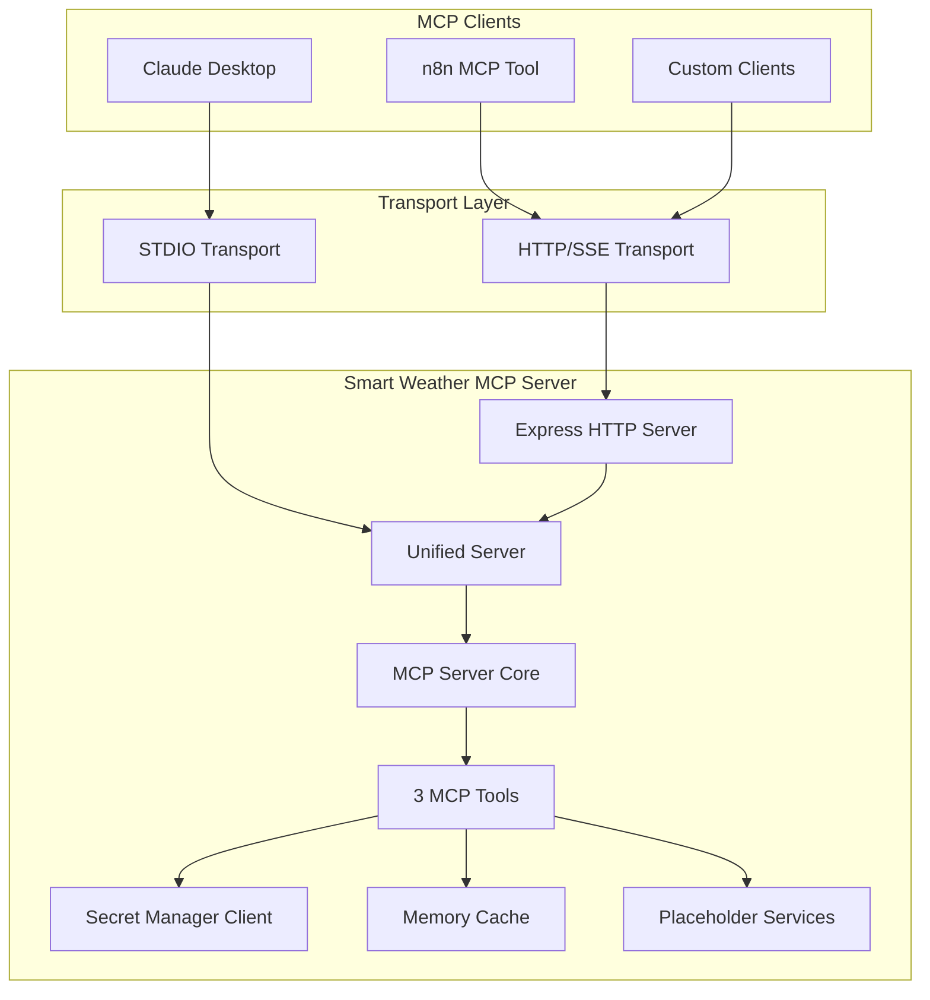
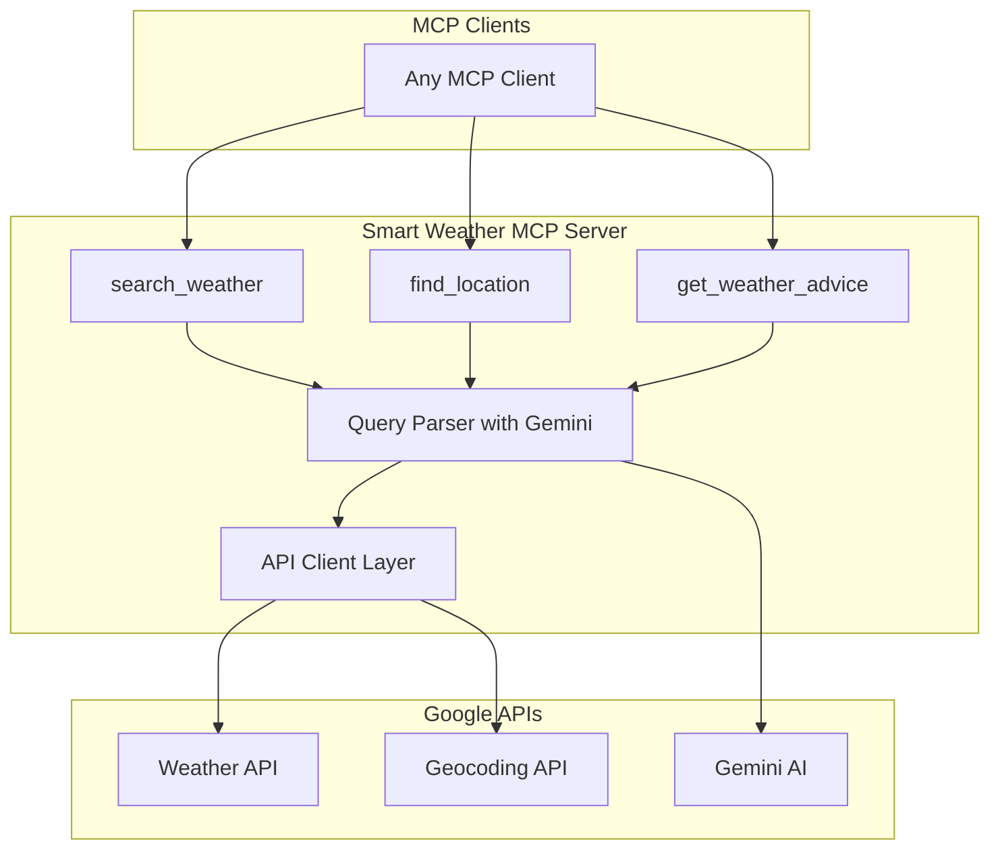

# 技術規格文件：Smart Weather MCP Server

## 1. 專案概述

### 1.1 背景與目標

開發一個基於 Model Context Protocol (MCP) 的天氣查詢服務，讓 AI 助手能夠透過自然語言查詢全球天氣資訊。採用 Shopify Storefront MCP 設計哲學，提供用戶意圖導向的智能工具。

**🎯 當前狀態**：Phase 2.1 解析優化中 - 基礎架構完成，發現純規則解析限制，正實現 Rule-Based + AI Fallback 混合架構。

**選擇 MCP 的原因**：

- 標準化的 AI 工具整合協議
- 支援實時雙向通信
- 與主流 AI 客戶端（Claude Desktop、Cursor 等）原生兼容
- 統一的工具發現和調用機制

### 1.2 功能範圍

**核心功能**：

- 3個用戶意圖導向的工具：`search_weather`、`find_location`、`get_weather_advice`
- 智能自然語言查詢解析（透過 Gemini AI）
- 全球天氣資料查詢（Google Weather API）
- 多語言支援（繁體中文、英文、日文）

**預期使用場景**：

- AI 助手中的天氣查詢對話
- 開發者工作流程中的天氣資訊整合
- 個人化天氣建議和行動指導
- Claude Desktop 本地工具整合（STDIO 模式）
- n8n 工作流程整合（HTTP/SSE 模式）

## 2. 系統架構

### 2.1 整體架構

**實際實現的架構**（Phase 1）：



**計劃中的完整架構**（Phase 2+）：

```mermaid
graph TB
    subgraph "Internet"
        A[MCP Clients] --> B[HTTPS]
    end
    
    subgraph "Google Cloud Platform"
        B --> C[Cloud Load Balancer]
        C --> D[Cloud Run Service]
        
        subgraph "Container Runtime"
            D --> E[Express HTTP Server]
            E --> F[Health Check Endpoint]
            E --> G[SSE Transport Handler]
            G --> H[3個MCP工具: search_weather, find_location, get_weather_advice]
            H --> I[查詢解析層]
            I --> J[Gemini AI 解析]
            J --> K[API 路由器]
            K --> L[記憶體快取]
            L --> M[Google API 客戶端]
        end
        
        D --> N[Secret Manager]
        D --> O[Cloud Logging]
        D --> P[Cloud Monitoring]
    end
    
    subgraph "外部服務"
        M --> Q[Google Weather API]
        M --> R[Google Geocoding API]
        J --> S[Gemini 2.5 Flash-Lite]
    end
```



### 2.2 主要組件

**已實現組件**：

**Phase 1 基礎架構（✅ 已完成）**：
| 組件 | 職責 | 實現狀態 | 實現方式 |
|------|------|----------|----------|
| **Unified Server** | 傳輸模式切換 | ✅ 已完成 | 命令行參數解析 |
| **Express HTTP Server** | HTTP 服務和路由 | ✅ 已完成 | Express.js 4.18+ |
| **Health Check Endpoint** | Cloud Run 健康檢查 | ✅ 已完成 | HTTP GET /health |
| **SSE Transport Handler** | MCP 協議通信 | ✅ 已完成 | MCP TypeScript SDK |
| **STDIO Transport Handler** | Claude Desktop 支援 | ✅ 已完成 | MCP TypeScript SDK |
| **統一工具處理器** | 3個工具的統一入口 | ✅ 已完成 | TypeScript 類別 |
| **Secret Manager 客戶端** | 密鑰管理 | ✅ 已完成 | @google-cloud/secret-manager |
| **記憶體快取** | 基礎快取框架 | ✅ 已完成 | JavaScript Map |

**Phase 2 智能解析（🔄 實現中）**：
| 組件 | 職責 | 實現狀態 | 實現方式 |
|------|------|----------|----------|
| **Gemini 解析器** | 自然語言理解 | ✅ 已完成 | Gemini 2.5 Flash 整合 |
| **查詢路由器** | 智能 API 選擇 | ✅ 已完成 | 多條件路由邏輯 |
| **API 選擇器** | API 端點選擇 | ✅ 已完成 | 策略模式實現 |
| **錯誤處理器** | 智能錯誤處理 | ✅ 已完成 | 分類錯誤與建議 |

**計劃中組件**（Phase 3+）：
| 組件 | 職責 | 實現狀態 | 計劃實現方式 |
|------|------|----------|-------------|
| **Google API 客戶端** | 外部 API 調用 | 📋 計劃中 | Axios HTTP 客戶端 |
| **天氣數據解析器** | API 響應解析 | 📋 計劃中 | 統一數據模型 |
| **進階快取系統** | 智能快取策略 | 📋 計劃中 | Redis/Memory 混合 |

## 3. 技術選擇與依賴

### 3.1 核心技術堆疊

```json
{
  "runtime": "Node.js 18+ (Container)",
  "language": "TypeScript 5.0+",
  "platform": "Google Cloud Run",
  "mcp_sdk": "@modelcontextprotocol/sdk@^1.17.1",
  "http_server": "express@^4.18.0",
  "http_client": "axios@^1.6.0",
  "secret_manager": "@google-cloud/secret-manager@^5.0.0",
  "cors": "cors@^2.8.5",
  "ai_provider": "Google Gemini 2.5 Flash-Lite",
  "weather_api": "Google Maps Platform Weather API",
  "transport": "HTTP/SSE only"
}
```

### 3.2 依賴庫

```json
// package.json 核心依賴（Cloud Run 優化）
{
  "name": "smart-weather-mcp-server",
  "description": "智能天氣查詢 MCP Server，部署在 Google Cloud Run",
  "version": "1.0.0",
  "type": "module",
  "engines": {
    "node": ">=18.0.0"
  },
  "scripts": {
    "build": "tsc",
    "start": "node dist/server.js",
    "dev": "tsx src/server.ts",
    "test": "jest",
    "docker:build": "docker build -t smart-weather-mcp .",
    "docker:run": "docker run -p 8080:8080 smart-weather-mcp"
  },
  "dependencies": {
    "@modelcontextprotocol/sdk": "^1.17.1",
    "@google-cloud/secret-manager": "^5.0.0",
    "express": "^4.18.0",
    "cors": "^2.8.5",
    "axios": "^1.6.0",
    "dotenv": "^16.3.1"
  },
  "devDependencies": {
    "@types/node": "^20.0.0",
    "@types/express": "^4.17.0",
    "@types/cors": "^2.8.17",
    "typescript": "^5.0.0",
    "tsx": "^4.0.0",
    "jest": "^29.0.0",
    "@types/jest": "^29.0.0"
  }
}
```

### 3.3 實現策略

採用模組化設計，支援未來多供應商切換：

```typescript
// 模組化服務實現（初期使用 Google，未來可擴展）
class WeatherService {
  async getCurrentWeather(location: string): Promise<WeatherData> { ... }
  async getForecast(location: string, days: number): Promise<ForecastData> { ... }
  async getHistoricalWeather(location: string, date: Date): Promise<WeatherData> { ... }
}

class AIQueryParser {
  async parseQuery(query: string, context?: string): Promise<ParsedQuery> { ... }
}

class GeocodingService {
  async searchLocation(query: string): Promise<Location[]> { ... }
}
```

**依賴說明**：

- `@modelcontextprotocol/sdk`：官方 MCP SDK，提供 SSE 傳輸支援
- `@google-cloud/secret-manager`：Google Cloud Secret Manager 客戶端
- `express`：HTTP 服務器，實現 Cloud Run HTTP 端點
- `cors`：跨域資源共享支援
- `axios`：HTTP 客戶端，用於調用外部 APIs
- `dotenv`：環境變數管理（開發環境）

**Cloud Run 實現策略**：

- **容器化部署**：使用 Docker 容器確保環境一致性
- **無伺服器架構**：利用 Cloud Run 自動擴展和按使用量計費
- **安全密鑰管理**：透過 Secret Manager 安全存取 API 密鑰
- **健康檢查整合**：實現 Cloud Run 要求的健康檢查端點
- **效能優化**：針對冷啟動和記憶體使用進行優化

## 4. 智能解析架構設計

### 4.1 整合 Gemini AI 解析層

基於 Shopify Storefront MCP 的 `query` + `context` 純文字參數設計，需要智能解析層：



### 4.2 設計優勢

- **自然語言支援** - 支援純文字查詢如 "台北今天天氣"
- **靈活的上下文理解** - 透過 context 參數提供偏好設定
- **符合 Storefront MCP 模式** - 使用相同的參數結構
- **智能解析** - Gemini 2.5 Flash-Lite 理解複雜查詢意圖
- **統一介面** - 所有工具都使用相同的參數模式

## 5. MCP 功能實現

### 5.1 工具定義

基於 [MCP TypeScript SDK](https://github.com/modelcontextprotocol/typescript-sdk) 的工具註冊模式：

```typescript
import { Server } from "@modelcontextprotocol/sdk/server/index.js";
import { StdioServerTransport } from "@modelcontextprotocol/sdk/server/stdio.js";

const server = new Server(
  {
    name: "google-weather-mcp-server",
    version: "1.0.0",
  },
  {
    capabilities: {
      tools: {},
    },
  }
);

// 工具 1: 智能天氣查詢
server.setRequestHandler("tools/call", async (request) => {
  if (request.params.name === "search_weather") {
    const { query, context } = request.params.arguments as {
      query: string;
      context?: string;
    };
    
    // 智能解析 -> API 路由 -> 格式化回應
    const result = await weatherService.searchWeather(query, context);
    
    return {
      content: [
        {
          type: "text",
          text: result.formattedResponse,
        },
      ],
    };
  }
});
```

### 5.2 工具詳細規格

#### search_weather 工具

```typescript
{
  name: "search_weather",
  description: "幫助用戶查找任何地點的天氣資訊，智能判斷查詢類型並提供相應的當前、預報或歷史天氣資料",
  inputSchema: {
    type: "object",
    properties: {
      query: {
        type: "string",
        description: "自然語言天氣查詢（如：台北今天天氣、東京下週預報）"
      },
      context: {
        type: "string", 
        description: "偏好設定（如：攝氏溫度、繁體中文、詳細程度）",
        optional: true
      }
    },
    required: ["query"]
  }
}
```

#### find_location 工具

```typescript
{
  name: "find_location",
  description: "幫助用戶發現和確認地點位置，解決地名模糊、地址不明確的問題，提供準確的地理資訊",
  inputSchema: {
    type: "object",
    properties: {
      query: {
        type: "string",
        description: "地點搜尋查詢（如：台北101、新竹科學園區）"
      },
      context: {
        type: "string",
        description: "地理偏好（如：台灣地區優先、返回詳細地址）",
        optional: true
      }
    },
    required: ["query"]
  }
}
```

#### get_weather_advice 工具

```typescript
{
  name: "get_weather_advice", 
  description: "基於天氣資訊提供個人化建議和行動指導，幫助用戶做出明智的活動決策"
  inputSchema: {
    type: "object",
    properties: {
      query: {
        type: "string",
        description: "活動決策查詢（如：適合出門嗎、該穿什麼、需要帶傘嗎）"
      },
      context: {
        type: "string",
        description: "個人偏好和活動類型（如：戶外運動、商務會議）",
        optional: true
      }
    },
    required: ["query"]
  }
}
```

## 6. 安全性和用戶授權

### 6.1 用戶授權策略

根據 [MCP 規格](https://modelcontextprotocol.io/specification/2025-06-18)的安全要求：

```typescript
// MCP 標準授權機制
class AuthorizationManager {
  private authorizedTools = new Set<string>();
  
  async requestAuthorization(toolName: string): Promise<boolean> {
    if (this.authorizedTools.has(toolName)) {
      return true; // 已授權
    }
    
    // 工具授權由 MCP 客戶端處理
    console.error(`工具授權請求: ${toolName}`);
    this.authorizedTools.add(toolName);
    return true;
  }
}
```

### 6.2 安全考量

- **工具授權**：每個 MCP 客戶端控制工具的使用權限
- **傳輸安全**：支援 TLS 加密的 HTTP/SSE 連接
- **資料隱私**：不儲存用戶查詢歷史，快取資料不含個人識別資訊

## 7. 數據流設計

### 7.1 請求處理流程

```mermaid
sequenceDiagram
    participant Client as MCP Client
    participant Server as MCP Server
    participant Parser as Query Parser
    participant AI as Gemini AI
    participant Cache as Memory Cache
    participant API as Google API
    
    Client->>Server: tools/call(search_weather)
    Server->>Parser: parseQuery(query, context)
    Parser->>AI: 解析自然語言
    AI->>Parser: 結構化查詢結果
    Parser->>Cache: 檢查快取
    
    alt 快取命中
        Cache->>Server: 返回快取結果
    else 快取未命中
        Parser->>API: 調用 Google Weather API
        API->>Parser: 原始天氣資料
        Parser->>Cache: 儲存到快取
        Parser->>Server: 格式化結果
    end
    
    Server->>Client: MCP 工具回應
```



### 7.2 錯誤處理流程

```typescript
// 錯誤處理策略
class WeatherServiceError extends Error {
  constructor(
    message: string,
    public code: string,
    public statusCode?: number,
    public originalError?: Error
  ) {
    super(message);
  }
}

// Google API 錯誤直接對應
const handleGoogleAPIError = (error: any): WeatherServiceError => {
  if (error.response?.status === 400) {
    return new WeatherServiceError(
      "查詢參數錯誤，請檢查地點名稱或時間範圍",
      "INVALID_QUERY",
      400,
      error
    );
  }
  
  if (error.response?.status === 401) {
    return new WeatherServiceError(
      "API 金鑰認證失敗",
      "AUTH_FAILED", 
      401,
      error
    );
  }
  
  if (error.response?.status === 403) {
    return new WeatherServiceError(
      "API 配額已用完或權限不足",
      "QUOTA_EXCEEDED",
      403,
      error
    );
  }
  
  if (error.response?.status === 404) {
    return new WeatherServiceError(
      "找不到指定地點，請嘗試更具體的地名",
      "LOCATION_NOT_FOUND",
      404,
      error
    );
  }
  
  if (error.response?.status === 429) {
    return new WeatherServiceError(
      "請求頻率過高，請稍後再試",
      "RATE_LIMITED",
      429,
      error
    );
  }
  
  return new WeatherServiceError(
    "天氣服務暫時不可用，請稍後再試",
    "SERVICE_UNAVAILABLE",
    500,
    error
  );
};
```

## 8. Gemini AI 整合實現

### 8.1 Gemini AI 整合

```typescript
import axios from 'axios';

class GeminiQueryParser {
  private apiKey: string;
  private model = 'gemini-2.5-flash-lite';
  
  async parseQuery(query: string, context?: string): Promise<ParsedQuery> {
    const prompt = this.buildPrompt(query, context);
    
    try {
      const response = await axios.post(
        `https://generativelanguage.googleapis.com/v1beta/models/${this.model}:generateContent`,
        {
          contents: [{
            parts: [{ text: prompt }]
          }],
          generationConfig: {
            temperature: 0.1,
            candidateCount: 1,
            maxOutputTokens: 1024,
          }
        },
        {
          headers: {
            'Content-Type': 'application/json',
            'x-goog-api-key': this.apiKey
          },
          timeout: 5000
        }
      );
      
      return this.parseGeminiResponse(response.data);
    } catch (error) {
      throw new WeatherServiceError(
        "查詢解析失敗",
        "PARSE_FAILED",
        500,
        error
      );
    }
  }
  
  private buildPrompt(query: string, context?: string): string {
    return `
請解析以下天氣查詢，返回 JSON 格式：

查詢: "${query}"
上下文: "${context || '無'}"

請返回以下格式的 JSON：
{
  "location": "地點名稱",
  "queryType": "current|forecast|history|advice",
  "timeScope": "具體時間範圍",
  "weatherFocus": "關注的天氣要素",
  "userPreferences": {
    "language": "zh-TW|en|ja",
    "temperatureUnit": "celsius|fahrenheit",
    "detailLevel": "basic|detailed"
  }
}
    `.trim();
  }
}
```

### 8.2 智能路由器

```typescript
class WeatherQueryRouter {
  route(parsedQuery: ParsedQuery): GoogleAPIEndpoint {
    switch (parsedQuery.queryType) {
      case 'current':
        return 'current-conditions';
      case 'forecast':
        return parsedQuery.timeScope.includes('hour') 
          ? 'hourly-forecast' 
          : 'daily-forecast';
      case 'history':
        return 'hourly-history';
      case 'advice':
        return 'current-conditions'; // 建議需要當前天氣
      default:
        return 'current-conditions';
    }
  }
}
```

## 9. 快取實現

### 9.1 記憶體快取策略

```typescript
interface CacheEntry<T> {
  data: T;
  timestamp: number;
  ttl: number;
}

class MemoryCache {
  private cache = new Map<string, CacheEntry<any>>();
  
  // 快取 TTL 設定（秒）
  private readonly TTL_CONFIG = {
    current: 300,      // 當前天氣: 5分鐘
    forecast: 1800,    // 預報資料: 30分鐘  
    history: 3600,     // 歷史資料: 1小時
    location: 86400,   // 地點資訊: 24小時
  };
  
  set<T>(key: string, data: T, type: keyof typeof this.TTL_CONFIG): void {
    const ttl = this.TTL_CONFIG[type];
    this.cache.set(key, {
      data,
      timestamp: Date.now(),
      ttl: ttl * 1000 // 轉換為毫秒
    });
  }
  
  get<T>(key: string): T | null {
    const entry = this.cache.get(key);
    if (!entry) return null;
    
    if (Date.now() - entry.timestamp > entry.ttl) {
      this.cache.delete(key);
      return null;
    }
    
    return entry.data;
  }
  
  generateKey(type: string, location: string, params?: any): string {
    const baseKey = `${type}:${location}`;
    if (params) {
      const paramStr = JSON.stringify(params);
      return `${baseKey}:${Buffer.from(paramStr).toString('base64')}`;
    }
    return baseKey;
  }
}
```

## 10. 部署與運行

### 10.1 本地開發設置

```bash
# 環境設置
npm init -y
npm install @modelcontextprotocol/sdk axios dotenv zod
npm install -D @types/node typescript tsx jest

# 環境變數檔案 (.env)
GOOGLE_WEATHER_API_KEY=your_weather_api_key
GOOGLE_GEOCODING_API_KEY=your_geocoding_api_key  
GOOGLE_GEMINI_API_KEY=your_gemini_api_key
GEMINI_MODEL=gemini-2.5-flash-lite
DEFAULT_LANGUAGE=zh-TW
DEFAULT_UNITS=celsius
CACHE_TTL_SECONDS=300
```

### 10.2 Cloud Run HTTP 服務器實現

基於 [Google Cloud Run MCP 最佳實踐](https://cloud.google.com/run/docs/host-mcp-servers)：

```typescript
// server.ts - Cloud Run 專用實現
import { Server } from "@modelcontextprotocol/sdk/server/index.js";
import { SSEServerTransport } from "@modelcontextprotocol/sdk/server/sse.js";
import { SecretManagerServiceClient } from "@google-cloud/secret-manager";
import express from "express";
import cors from "cors";

async function main() {
  const app = express();
  
  // Cloud Run 基本配置
  app.use(express.json());
  app.use(cors({
    origin: true,
    credentials: true
  }));
  
  // Secret Manager 客戶端
  const secretClient = new SecretManagerServiceClient();
  
  // 從 Secret Manager 載入 API 密鑰
  const secrets = await loadSecrets(secretClient);
  
  // MCP Server 初始化
  const server = new Server({
    name: "smart-weather-mcp-server",
    version: "1.0.0"
  }, {
    capabilities: {
      tools: {}
    }
  });
  
  // 註冊工具處理器
  setupToolHandlers(server, secrets);
  
  // 健康檢查端點（Cloud Run 要求）
  app.get('/health', (req, res) => {
    res.status(200).json({
      status: 'healthy',
      timestamp: new Date().toISOString(),
      version: '1.0.0'
    });
  });
  
  // 儲存 SSE 連接
  const transports: Record<string, SSEServerTransport> = {};
  
  // SSE 端點
  app.get('/sse', async (req, res) => {
    try {
      const transport = new SSEServerTransport('/messages', res);
      transports[transport.sessionId] = transport;
      
      res.on("close", () => {
        delete transports[transport.sessionId];
        console.log(`SSE connection closed: ${transport.sessionId}`);
      });
      
      await server.connect(transport);
      console.log(`SSE connection established: ${transport.sessionId}`);
      
    } catch (error) {
      console.error('SSE connection error:', error);
      res.status(500).send('SSE connection failed');
    }
  });
  
  // 訊息處理端點
  app.post('/messages', async (req, res) => {
    const sessionId = req.query.sessionId as string;
    const transport = transports[sessionId];
    
    if (transport) {
      try {
        await transport.handlePostMessage(req, res, req.body);
      } catch (error) {
        console.error('Message handling error:', error);
        res.status(500).send('Message handling failed');
      }
    } else {
      res.status(400).send('No transport found for sessionId');
    }
  });
  
  // 根目錄端點
  app.get('/', (req, res) => {
    res.json({
      name: 'Smart Weather MCP Server',
      version: '1.0.0',
      endpoints: {
        health: '/health',
        sse: '/sse',
        messages: '/messages'
      }
    });
  });
  
  // 啟動服務器
  const port = process.env.PORT || 8080;
  app.listen(port, () => {
    console.log(`Smart Weather MCP Server running on port ${port}`);
    console.log(`Health check: http://localhost:${port}/health`);
    console.log(`SSE endpoint: http://localhost:${port}/sse`);
  });
}

// Secret Manager 密鑰載入
async function loadSecrets(client: SecretManagerServiceClient) {
  const project = process.env.GOOGLE_CLOUD_PROJECT;
  
  const secrets = {
    weatherApiKey: await getSecret(client, `projects/${project}/secrets/weather-api-key/versions/latest`),
    geocodingApiKey: await getSecret(client, `projects/${project}/secrets/geocoding-api-key/versions/latest`),
    geminiApiKey: await getSecret(client, `projects/${project}/secrets/gemini-api-key/versions/latest`)
  };
  
  return secrets;
}

async function getSecret(client: SecretManagerServiceClient, name: string) {
  try {
    const [version] = await client.accessSecretVersion({ name });
    return version.payload?.data?.toString();
  } catch (error) {
    console.error(`Failed to load secret ${name}:`, error);
    throw error;
  }
}

main().catch(console.error);
```

### 10.3 Dockerfile 配置

```dockerfile
# Dockerfile
FROM node:18-alpine

# 設定工作目錄
WORKDIR /app

# 複製 package files
COPY package*.json ./
COPY tsconfig.json ./

# 安裝依賴
RUN npm ci --only=production

# 複製源代碼
COPY src/ ./src/

# 建置應用
RUN npm run build

# 移除開發依賴
RUN npm prune --production

# 建立非 root 用戶
RUN addgroup -g 1001 -S nodejs
RUN adduser -S nextjs -u 1001
USER nextjs

# 暴露端口
EXPOSE 8080

# 設定健康檢查
HEALTHCHECK --interval=30s --timeout=3s --start-period=5s --retries=3 \
  CMD curl -f http://localhost:8080/health || exit 1

# 啟動應用
CMD ["npm", "start"]
```

**Cloud Run 實現說明**：

- **專用於 HTTP/SSE**：移除 STDIO 支援，專注於 Web 傳輸
- **健康檢查整合**：提供 `/health` 端點供 Cloud Run 監控
- **Secret Manager 整合**：安全載入 API 密鑰
- **錯誤處理增強**：完整的錯誤處理和日誌記錄
- **容器優化**：使用 Alpine Linux 減少映像大小

### 10.4 CI/CD 配置

#### GitHub Actions 部署配置

```yaml
# .github/workflows/deploy.yml
name: Deploy to Cloud Run

on:
  push:
    branches: [ main ]
  pull_request:
    branches: [ main ]

env:
  PROJECT_ID: ${{ secrets.GCP_PROJECT_ID }}
  SERVICE_NAME: smart-weather-mcp
  REGION: asia-east1

jobs:
  test:
    runs-on: ubuntu-latest
    steps:
    - uses: actions/checkout@v3
    
    - name: Setup Node.js
      uses: actions/setup-node@v3
      with:
        node-version: '18'
        cache: 'npm'
    
    - name: Install dependencies
      run: npm ci
    
    - name: Run tests
      run: npm test
    
    - name: Build application
      run: npm run build

  deploy:
    needs: test
    runs-on: ubuntu-latest
    if: github.ref == 'refs/heads/main'
    
    steps:
    - uses: actions/checkout@v3
    
    - name: Setup Google Cloud SDK
      uses: google-github-actions/setup-gcloud@v1
      with:
        service_account_key: ${{ secrets.GCP_SA_KEY }}
        project_id: ${{ secrets.GCP_PROJECT_ID }}
    
    - name: Configure Docker
      run: gcloud auth configure-docker
    
    - name: Build and push Docker image
      run: |
        docker build -t gcr.io/$PROJECT_ID/$SERVICE_NAME:$GITHUB_SHA .
        docker push gcr.io/$PROJECT_ID/$SERVICE_NAME:$GITHUB_SHA
    
    - name: Deploy to Cloud Run
      run: |
        gcloud run deploy $SERVICE_NAME \
          --image gcr.io/$PROJECT_ID/$SERVICE_NAME:$GITHUB_SHA \
          --platform managed \
          --region $REGION \
          --port 8080 \
          --memory 1Gi \
          --cpu 1 \
          --min-instances 0 \
          --max-instances 10 \
          --concurrency 100 \
          --timeout 300 \
          --set-env-vars "NODE_ENV=production" \
          --set-secrets "GOOGLE_WEATHER_API_KEY=weather-api-key:latest" \
          --set-secrets "GOOGLE_GEOCODING_API_KEY=geocoding-api-key:latest" \
          --set-secrets "GOOGLE_GEMINI_API_KEY=gemini-api-key:latest" \
          --allow-unauthenticated
```

#### Cloud Build 配置

```yaml
# cloudbuild.yaml
steps:
  # Install dependencies
  - name: 'node:18'
    entrypoint: 'npm'
    args: ['ci']

  # Run tests
  - name: 'node:18'
    entrypoint: 'npm'
    args: ['test']

  # Build application
  - name: 'node:18'
    entrypoint: 'npm'
    args: ['run', 'build']

  # Build Docker image
  - name: 'gcr.io/cloud-builders/docker'
    args: ['build', '-t', 'gcr.io/$PROJECT_ID/smart-weather-mcp:$COMMIT_SHA', '.']

  # Push to Container Registry
  - name: 'gcr.io/cloud-builders/docker'
    args: ['push', 'gcr.io/$PROJECT_ID/smart-weather-mcp:$COMMIT_SHA']

  # Deploy to Cloud Run
  - name: 'gcr.io/cloud-builders/gcloud'
    args:
    - 'run'
    - 'deploy'
    - 'smart-weather-mcp'
    - '--image=gcr.io/$PROJECT_ID/smart-weather-mcp:$COMMIT_SHA'
    - '--region=asia-east1'
    - '--platform=managed'
    - '--port=8080'
    - '--memory=1Gi'
    - '--cpu=1'
    - '--min-instances=0'
    - '--max-instances=10'
    - '--concurrency=100'
    - '--timeout=300'
    - '--set-env-vars=NODE_ENV=production'
    - '--set-secrets=GOOGLE_WEATHER_API_KEY=weather-api-key:latest'
    - '--set-secrets=GOOGLE_GEOCODING_API_KEY=geocoding-api-key:latest'
    - '--set-secrets=GOOGLE_GEMINI_API_KEY=gemini-api-key:latest'
    - '--allow-unauthenticated'

images:
- 'gcr.io/$PROJECT_ID/smart-weather-mcp:$COMMIT_SHA'

options:
  logging: CLOUD_LOGGING_ONLY
```

### 10.5 部署腳本

```bash
#!/bin/bash
# deploy.sh - 本地部署腳本

set -e

PROJECT_ID=${1:-"your-project-id"}
REGION=${2:-"asia-east1"}
SERVICE_NAME="smart-weather-mcp"

echo "Deploying Smart Weather MCP Server to Cloud Run..."
echo "Project: $PROJECT_ID"
echo "Region: $REGION"

# 1. 建置 Docker 映像
echo "Building Docker image..."
gcloud builds submit --tag gcr.io/$PROJECT_ID/$SERVICE_NAME

# 2. 部署到 Cloud Run
echo "Deploying to Cloud Run..."
gcloud run deploy $SERVICE_NAME \
  --image gcr.io/$PROJECT_ID/$SERVICE_NAME \
  --platform managed \
  --region $REGION \
  --port 8080 \
  --memory 1Gi \
  --cpu 1 \
  --min-instances 0 \
  --max-instances 10 \
  --concurrency 100 \
  --timeout 300 \
  --set-env-vars "NODE_ENV=production,GEMINI_MODEL=gemini-2.5-flash-lite" \
  --set-secrets "GOOGLE_WEATHER_API_KEY=weather-api-key:latest" \
  --set-secrets "GOOGLE_GEOCODING_API_KEY=geocoding-api-key:latest" \
  --set-secrets "GOOGLE_GEMINI_API_KEY=gemini-api-key:latest" \
  --allow-unauthenticated

# 3. 驗證部署
echo "Verifying deployment..."
SERVICE_URL=$(gcloud run services describe $SERVICE_NAME --region $REGION --format 'value(status.url)')
echo "Service deployed at: $SERVICE_URL"

# 健康檢查
echo "Performing health check..."
curl -f $SERVICE_URL/health || echo "Health check failed"

echo "Deployment completed successfully!"
```

## 11. 測試策略

### 11.1 測試架構

```mermaid
graph TB
    subgraph "測試層級"
        A[單元測試] --> B[整合測試]
        B --> C[端到端測試]
    end
    
    subgraph "測試範圍"
        D[Gemini 解析器測試]
        E[API 客戶端測試] 
        F[快取機制測試]
        G[MCP 工具測試]
        H[錯誤處理測試]
    end
    
    A --- D
    A --- E
    A --- F
    B --- G
    C --- H
```



### 11.2 關鍵測試案例

```typescript
// 單元測試範例
describe('GeminiQueryParser', () => {
  test('解析當前天氣查詢', async () => {
    const parser = new GeminiQueryParser(mockApiKey);
    const result = await parser.parseQuery('台北今天天氣如何？');
    
    expect(result.location).toBe('台北');
    expect(result.queryType).toBe('current');
    expect(result.userPreferences.language).toBe('zh-TW');
  });
  
  test('解析預報查詢', async () => {
    const result = await parser.parseQuery('東京下週天氣預報');
    
    expect(result.location).toBe('東京');
    expect(result.queryType).toBe('forecast');
    expect(result.timeScope).toContain('week');
  });
});

// 整合測試範例  
describe('WeatherService Integration', () => {
  test('完整查詢流程', async () => {
    const service = new WeatherService();
    const result = await service.searchWeather('台北今天天氣');
    
    expect(result.success).toBe(true);
    expect(result.data.location).toBeDefined();
    expect(result.data.temperature).toBeDefined();
  });
});
```

## 12. 監控與效能

### 12.1 效能指標

| 指標 | 目標值 | 監控方式 |
|------|--------|----------|
| 平均回應時間 | ≤ 1.5秒 | 請求計時 |
| Gemini 解析時間 | ≤ 500ms | API 計時 |
| 快取命中率 | ≥ 60% | 快取統計 |
| API 成功率 | ≥ 95% | 錯誤統計 |

### 12.2 日誌策略

```typescript
// 簡單日誌實現
class Logger {
  private logLevel = process.env.LOG_LEVEL || 'info';
  
  info(message: string, meta?: any): void {
    console.error(`[INFO] ${new Date().toISOString()} ${message}`, meta || '');
  }
  
  error(message: string, error?: Error): void {
    console.error(`[ERROR] ${new Date().toISOString()} ${message}`, error?.stack || '');
  }
  
  warn(message: string, meta?: any): void {
    console.error(`[WARN] ${new Date().toISOString()} ${message}`, meta || '');
  }
}
```

## 13. 未來擴展考慮

### 13.1 實際升級路徑

**✅ Phase 1 已完成**（基礎架構）：
- STDIO/HTTP 雙傳輸模式
- 統一傳輸模式切換
- 記憶體快取框架
- Secret Manager 整合
- MCP 工具註冊框架
- Claude Desktop 整合

**🔄 Phase 2.1 解析優化中**（混合解析架構）：
- ✅ Gemini AI 解析整合（完成）
- ✅ 查詢路由器實現（完成）
- ✅ 多語言支援（中英日）（完成）
- ✅ 智能錯誤處理（完成）
- 🔄 **Rule-Based + AI Fallback** - 當前工作重點
  - ❌ **問題**: 複雜中文查詢信心度不足 ("沖繩明天天氣預報 衝浪條件")
  - 🛠️ **解決**: 實現混合解析架構，簡化規則 + AI fallback
- 📋 Google Weather API 整合（Phase 3）

**📋 Phase 3 計劃**（增強功能）：
- 進階快取策略
- 效能監控與分析
- 批次查詢支援
- Cloud Run 部署優化

```mermaid
graph LR
    A[Phase 1 ✅<br/>基礎架構] --> B[Phase 2 📋<br/>核心功能]
    B --> C[Phase 3 📋<br/>增強功能]
    
    subgraph "Phase 1 已完成"
        D[雙傳輸模式]
        E[MCP 框架]
        F[Secret Manager]
    end
    
    subgraph "Phase 2 計劃"
        G[Gemini 解析]
        H[Weather API]
        I[智能路由]
    end
    
    subgraph "Phase 3 計劃"
        J[多語言支援]
        K[Cloud Run 優化]
        L[進階監控]
    end
```



### 13.2 重構考量

當未來需要支援多供應商時，可考慮以下重構策略：

- **階段性重構**：先將現有 Google 實現封裝成服務類別
- **配置驅動**：透過環境變數或配置檔案選擇供應商
- **漸進式遷移**：保持現有 API 不變，內部實現逐步抽象化

這種方式避免過早優化，讓初期開發更專注於核心功能實現。

## 14. 驗收標準

### 14.1 功能需求驗收

**✅ Phase 1 已完成**：
- [x] 3個 MCP 工具正常註冊和調用
- [x] 雙傳輸模式支援（STDIO/HTTP）
- [x] 統一傳輸模式切換
- [x] Secret Manager 整合
- [x] 記憶體快取基礎框架
- [x] Claude Desktop 整合支援
- [x] Express HTTP 服務器
- [x] 健康檢查端點

**🔄 Phase 2 實現中**：
- [x] Gemini AI 查詢解析（完成，準確率待測）
- [x] 多語言回應支援（中、英、日）
- [x] 智能查詢路由
- [x] 意圖分類與位置提取
- [ ] Google Weather API 整合（待實現）

**📋 Phase 3+ 計劃中**：
- [ ] 進階快取策略
- [ ] 批次查詢支援
- [ ] 效能監控與分析

### 14.2 Phase 1 非功能需求驗收

**✅ 已完成**：
- [x] SSE 傳輸穩定運行
- [x] STDIO 傳輸穩定運行
- [x] 健康檢查端點正常回應
- [x] Secret Manager 密鑰載入成功
- [x] TypeScript 編譯成功
- [x] 開發/生產環境配置
- [x] Claude Desktop 整合測試通過

**📋 Phase 2+ 計劃中**：
- [ ] 平均回應時間 ≤ 1.5秒
- [ ] Cloud Run 冷啟動時間 ≤ 2秒
- [ ] API 調用成功率 ≥ 95%
- [ ] 快取命中率 ≥ 60%
- [ ] 容器映像建置成功
- [ ] Cloud Run 自動擴展正常運作
- [ ] 錯誤處理涵蓋所有 Google API 錯誤碼
