# 產品需求文件 (PRD)：Smart Weather MCP Server

## 概述

### 產品願景

建立一個 Model Context Protocol (MCP) Server，讓 AI 大型語言模型（如 Claude、GPT 等）能夠透過**用戶意圖導向的智能工具**查詢全球各地的天氣資訊。採用模組化架構設計，初期整合 Google Maps Platform Weather API 和 Gemini AI，未來可彈性切換其他天氣資料供應商。遵循 Shopify Storefront MCP 設計哲學，提供直觀、易用的天氣查詢體驗。

### 目標使用者

- 使用 MCP 兼容客戶端（如 Claude Desktop、Cursor、n8n 等）的使用者
- 需要在 AI 對話中查詢即時天氣資訊的開發者
- 希望將天氣資訊整合到 AI 工作流程中的企業使用者

## 系統架構

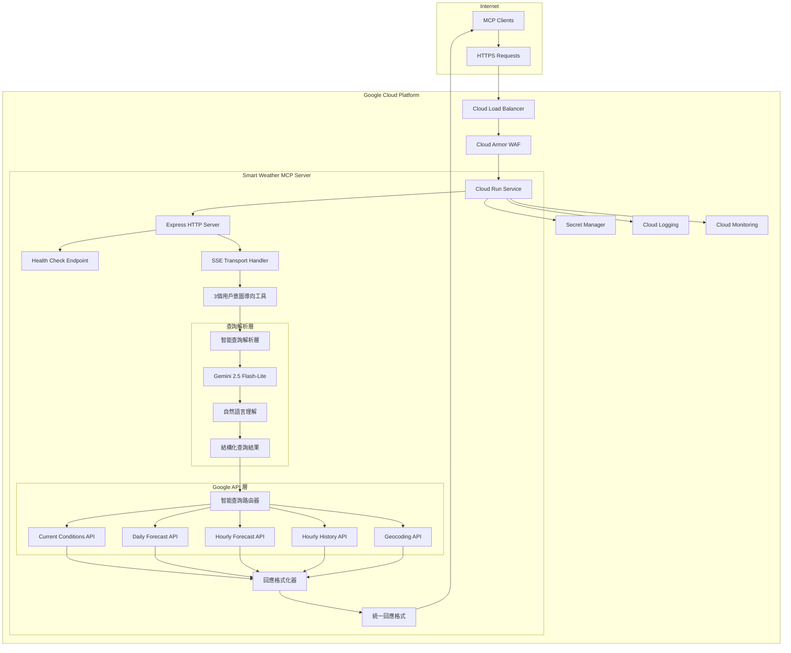

## 核心功能

### 用戶意圖導向的3工具設計

嚴格遵循 Shopify Storefront MCP Server 設計哲學，採用用戶意圖導向的工具設計：

#### 1. `search_weather` - 智能天氣查詢

**用戶意圖**: "我想知道天氣資訊"

**參數結構**:

- `query` (必須): 用戶的天氣查詢需求（如：台北今天天氣、東京下週預報、紐約歷史天氣）
- `context` (可選): 偏好設定和額外上下文（如：攝氏溫度、繁體中文、詳細程度）

**智能路由**: 自動判斷查詢類型並調用適當的 Google Weather API（當前、預報、歷史）

#### 2. `find_location` - 地點發現與確認

**用戶意圖**: "我需要確認地點位置"

**參數結構**:

- `query` (必須): 地點搜尋查詢（如：台北101、新竹科學園區、模糊地址）
- `context` (可選): 地理偏好和搜尋限制（如：台灣地區優先、返回詳細地址）

**智能功能**: 處理模糊地名、提供多個選項、地址標準化

#### 3. `get_weather_advice` - 個人化天氣建議

**用戶意圖**: "基於天氣我該怎麼做？"

**參數結構**:

- `query` (必須): 活動或決策查詢（如：適合出門嗎、該穿什麼、需要帶傘嗎）
- `context` (可選): 個人偏好和活動類型（如：戶外運動、商務會議、旅遊計畫）

**智能建議**: 結合天氣資料提供可執行的個人化建議

**設計優勢**:

- **符合 3-4 工具限制** - 精確 3 個工具
- **用戶意圖導向命名** - 每個工具名稱回答用戶需求
- **統一參數結構** - 所有工具使用相同的 `query` + `context` 模式
- **智能協作設計** - 工具間形成完整的用戶旅程
- **業務價值導向** - 每個工具解決真實用戶問題並提供可執行建議

## 技術規格

### 技術堆疊

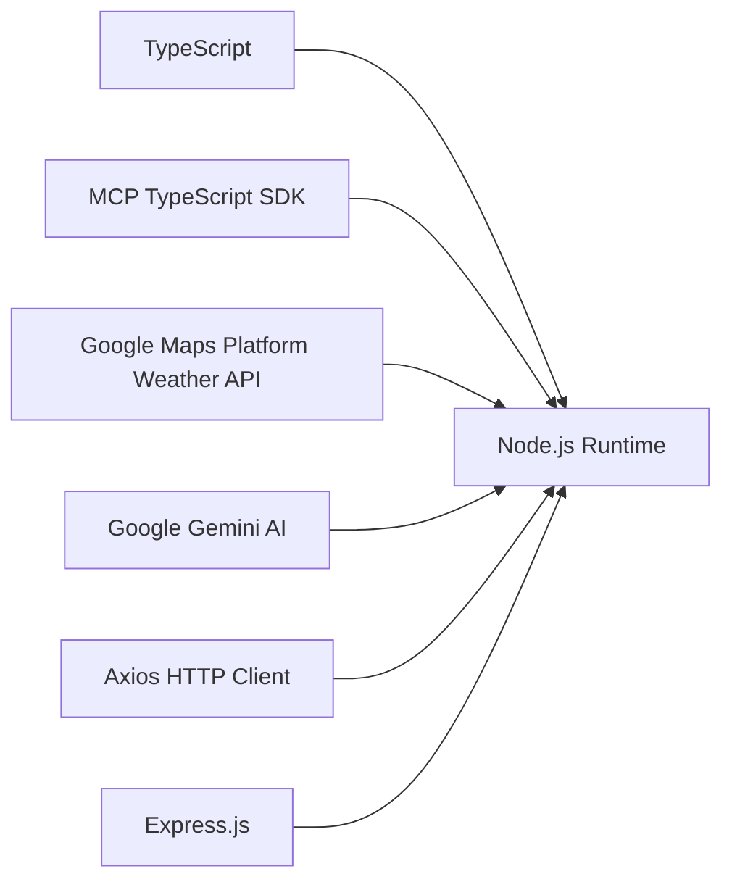

- **程式語言**: TypeScript
- **MCP SDK**: Model Context Protocol TypeScript SDK v1.17.0
- **AI 解析**: Google Gemini 2.5 Flash-Lite (Vertex AI)
- **天氣 API**: Google Maps Platform Weather API
- **地理編碼**: Google Maps Geocoding API  
- **HTTP 客戶端**: Axios
- **HTTP 伺服器**: Express.js (Cloud Run 優化)
- **運行環境**: Node.js 18+ 容器
- **部署平台**: Google Cloud Run
- **容器化**: Docker

### Cloud Run 部署特點

Smart Weather MCP Server 針對 Google Cloud Run 進行優化設計：

- **HTTP/SSE Transport** - 使用 Server-Sent Events 提供即時通訊
- **無伺服器架構** - 自動擴展和按使用量計費
- **健康檢查** - 內建 `/health` 端點支援 Cloud Run 監控
- **容器化部署** - 使用 Docker 容器確保一致性
- **環境變數整合** - 支援 Cloud Run 環境變數和 Secret Manager
- **冷啟動優化** - 針對 Cloud Run 冷啟動進行效能優化

### 系統組件

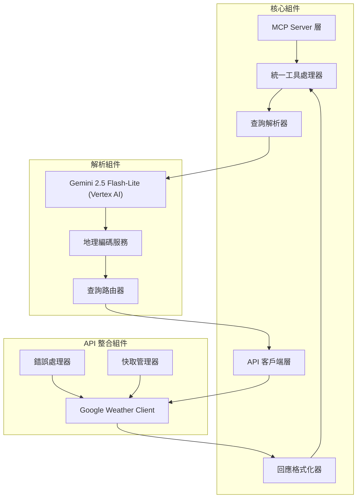

## 查詢解析流程

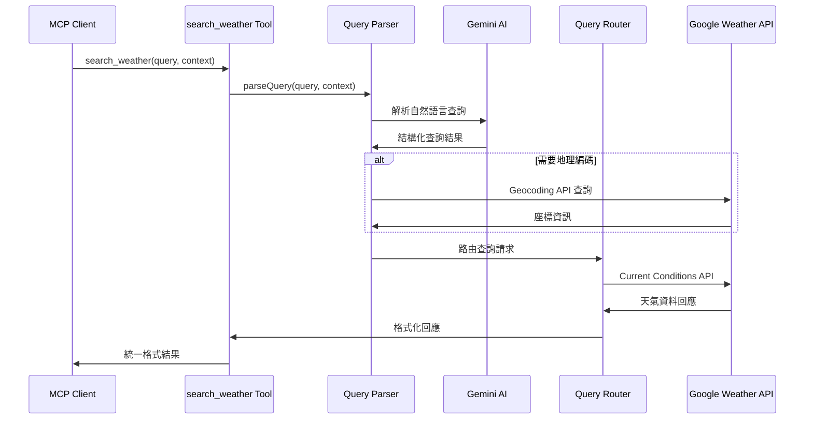

## 工具定義

### search_weather 工具

```json
{
  "name": "search_weather",
  "description": "幫助用戶查找任何地點的天氣資訊，智能判斷查詢類型並提供相應的當前、預報或歷史天氣資料",
  "inputSchema": {
    "type": "object",
    "properties": {
      "query": {
        "type": "string",
        "description": "用戶的天氣查詢需求（如：台北今天天氣、東京下週預報、紐約上個月天氣）"
      },
      "context": {
        "type": "string",
        "description": "偏好設定和額外上下文，如溫度單位、語言、詳細程度等（可選）"
      }
    },
    "required": ["query"]
  }
}
```

### find_location 工具

```json
{
  "name": "find_location",
  "description": "幫助用戶發現和確認地點位置，解決地名模糊、地址不明確的問題，提供準確的地理資訊",
  "inputSchema": {
    "type": "object",
    "properties": {
      "query": {
        "type": "string",
        "description": "地點搜尋查詢（如：台北101、新竹科學園區、模糊地址描述）"
      },
      "context": {
        "type": "string",
        "description": "地理偏好和搜尋限制，如偏好國家地區、返回格式等（可選）"
      }
    },
    "required": ["query"]
  }
}
```

### get_weather_advice 工具

```json
{
  "name": "get_weather_advice",
  "description": "基於天氣資訊提供個人化建議和行動指導，幫助用戶做出明智的活動決策",
  "inputSchema": {
    "type": "object",
    "properties": {
      "query": {
        "type": "string",
        "description": "活動或決策查詢（如：適合出門嗎、該穿什麼衣服、需要帶傘嗎、適合運動嗎）"
      },
      "context": {
        "type": "string",
        "description": "個人偏好和活動類型，如戶外運動、商務會議、旅遊計畫等（可選）"
      }
    },
    "required": ["query"]
  }
}
```

## 使用範例

### search_weather 工具使用

```json
// 當前天氣查詢
{
  "name": "search_weather",
  "arguments": {
    "query": "台北今天天氣如何？",
    "context": "使用攝氏溫度，繁體中文回應"
  }
}

// 天氣預報查詢
{
  "name": "search_weather",
  "arguments": {
    "query": "東京下週天氣預報",
    "context": "包含降雨機率和每日最高最低溫"
  }
}

// 歷史天氣查詢
{
  "name": "search_weather",
  "arguments": {
    "query": "紐約上個月天氣狀況",
    "context": "需要每日平均溫度資料"
  }
}

// 每小時預報查詢
{
  "name": "search_weather",
  "arguments": {
    "query": "台北今天24小時詳細天氣變化"
  }
}
```

### find_location 工具使用

```json
// 精確地點搜尋
{
  "name": "find_location",
  "arguments": {
    "query": "台北101",
    "context": "需要詳細地址和座標資訊"
  }
}

// 模糊地名解析
{
  "name": "find_location",
  "arguments": {
    "query": "新竹科學園區",
    "context": "台灣地區，提供多個選項"
  }
}

// 地理區域搜尋
{
  "name": "find_location",
  "arguments": {
    "query": "東京都心",
    "context": "日本地區，商業區優先"
  }
}
```

### get_weather_advice 工具使用

```json
// 外出建議
{
  "name": "get_weather_advice",
  "arguments": {
    "query": "今天適合出門嗎？",
    "context": "計劃在台北進行戶外活動"
  }
}

// 穿著建議
{
  "name": "get_weather_advice",
  "arguments": {
    "query": "明天該穿什麼衣服？",
    "context": "東京商務會議，需要正式服裝建議"
  }
}

// 活動規劃建議
{
  "name": "get_weather_advice",
  "arguments": {
    "query": "這週末適合戶外運動嗎？",
    "context": "計劃在台北進行慢跑和騎腳踏車"
  }
}

// 旅遊準備建議
{
  "name": "get_weather_advice",
  "arguments": {
    "query": "去紐約旅遊需要準備什麼？",
    "context": "下週出差3天，需要行李準備建議"
  }
}
```

### 工具協作流程

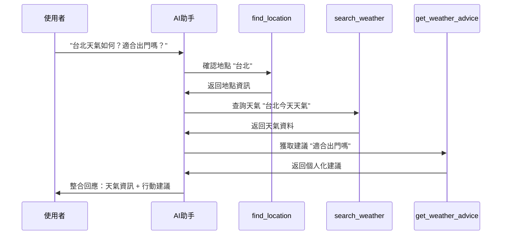

## 智能解析架構設計

### 整合 Gemini AI 解析層

基於 Shopify Storefront MCP 的 `query` + `context` 純文字參數設計，需要智能解析層：

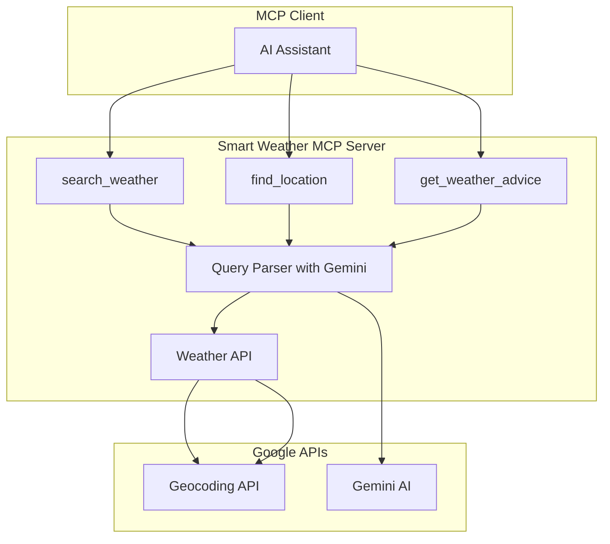

### 設計優勢

- **自然語言支援** - 支援純文字查詢如 "台北今天天氣"
- **靈活的上下文理解** - 透過 context 參數提供偏好設定
- **符合 Storefront MCP 模式** - 使用相同的參數結構
- **智能解析** - Gemini 2.5 Flash-Lite 理解複雜查詢意圖
- **統一介面** - 所有工具都使用相同的參數模式

## Gemini 2.5 Flash-Lite 優勢

### 為什麼選擇 Gemini 2.5 Flash-Lite

基於 [Google Cloud Vertex AI 文件](https://cloud.google.com/vertex-ai/generative-ai/docs/models/gemini/2-5-flash-lite?hl=zh-tw)，Gemini 2.5 Flash-Lite 是專為高頻率、低延遲應用設計的輕量級模型：

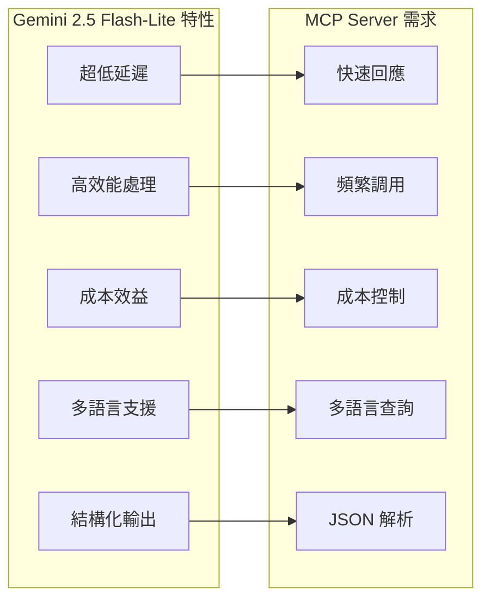

### 核心優勢

1. **超低延遲** - 平均回應時間 < 500ms，完美符合 MCP 即時互動需求
2. **高效能處理** - 優化的輕量架構，支援高頻率 API 調用
3. **成本效益** - 相比完整版 Gemini 模型，成本降低 60-80%
4. **多語言原生支援** - 對繁體中文、英文、日文有優秀的理解能力
5. **結構化輸出** - 直接輸出 JSON 格式，減少後處理需求

### 在天氣查詢中的應用

```json
{
  "input": {
    "query": "台北今天下午會下雨嗎？",
    "context": "用戶偏好攝氏溫度，繁體中文回應"
  },
  "gemini_analysis": {
    "location": "台北市",
    "coordinates": {"lat": 25.0330, "lng": 121.5654},
    "query_type": "current_weather",
    "time_scope": "today_afternoon",
    "weather_focus": "precipitation",
    "user_preferences": {
      "temperature_unit": "celsius",
      "language": "zh-TW"
    }
  }
}
```

## API 整合

### Google Weather API 端點整合

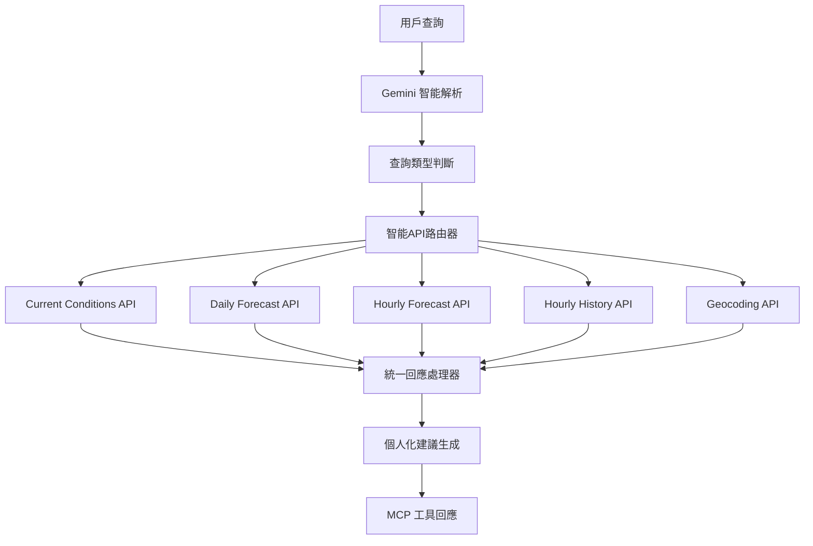

### 智能路由策略

| MCP 工具 | 查詢類型判斷 | 路由到的 Google API | 附加處理 |
|----------|-------------|-------------------|---------|
| `search_weather` | 當前天氣查詢 | [Current Conditions](https://developers.google.com/maps/documentation/weather/current-conditions) | 天氣狀況描述 |
| `search_weather` | 預報查詢 | [Daily/Hourly Forecast](https://developers.google.com/maps/documentation/weather/daily-forecast) | 趨勢分析 |
| `search_weather` | 歷史查詢 | [Hourly History](https://developers.google.com/maps/documentation/weather/hourly-history) | 歷史比較 |
| `find_location` | 地點解析 | [Geocoding API](https://developers.google.com/maps/documentation/geocoding/geocoding) | 地點標準化 |
| `get_weather_advice` | 建議需求 | 組合多個API | 個人化建議生成 |

### 智能解析與路由映射

| 用戶查詢範例 | Gemini 解析結果 | 路由決策 | API 調用 |
|------------|----------------|---------|---------|
| "台北今天天氣" | 地點: 台北, 時間: 當前 | 當前天氣查詢 | Current Conditions API |
| "東京下週預報" | 地點: 東京, 時間: 未來7天 | 每日預報查詢 | Daily Forecast API |
| "紐約每小時天氣" | 地點: 紐約, 詳細度: 小時 | 每小時預報查詢 | Hourly Forecast API |
| "台北上週天氣" | 地點: 台北, 時間: 過去7天 | 歷史資料查詢 | Hourly History API |
| "適合出門嗎" | 活動: 外出, 需求: 建議 | 建議生成 | 組合API + AI建議 |

## 錯誤處理

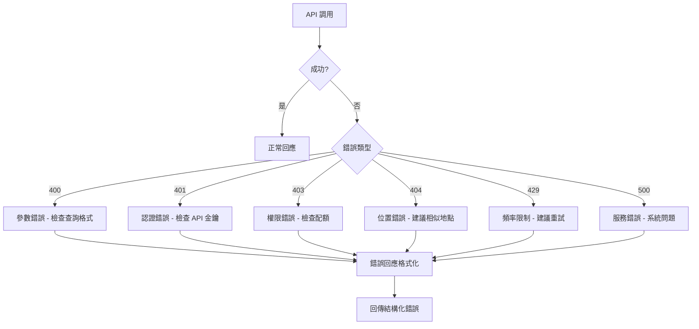

## 效能優化

### 快取策略

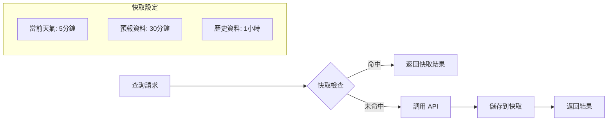

### 回應時間目標

```mermaid
gantt
    title 效能指標
    dateFormat X
    axisFormat %s
    
    section 回應時間
    Gemini 解析     :0, 2
    API 調用        :2, 3
    資料處理        :3, 1
    總回應時間      :0, 3
```

## 部署配置

### Cloud Run 環境變數配置

```bash
# Cloud Run 特定配置
PORT=${PORT:-8080}  # Cloud Run 自動設置，預設 8080
GOOGLE_CLOUD_PROJECT=your-project-id

# Google API 金鑰（透過 Secret Manager）
GOOGLE_WEATHER_API_KEY_SECRET=projects/your-project-id/secrets/weather-api-key/versions/latest
GOOGLE_GEOCODING_API_KEY_SECRET=projects/your-project-id/secrets/geocoding-api-key/versions/latest
GOOGLE_GEMINI_API_KEY_SECRET=projects/your-project-id/secrets/gemini-api-key/versions/latest

# 服務配置
NODE_ENV=production
GEMINI_MODEL=gemini-2.5-flash-lite
CACHE_TTL_SECONDS=300
DEFAULT_LANGUAGE=zh-TW
DEFAULT_UNITS=celsius

# 效能配置
MAX_SEARCH_RESULTS=10
API_TIMEOUT_MS=5000
MAX_CONCURRENT_REQUESTS=100

# Cloud Run 優化
ENABLE_CORS=true
HEALTH_CHECK_PATH=/health
SSE_ENDPOINT_PATH=/sse
MESSAGES_ENDPOINT_PATH=/messages

# 監控配置
LOG_LEVEL=info
ENABLE_REQUEST_LOGGING=true
ENABLE_PERFORMANCE_MONITORING=true
```

### Secret Manager 密鑰管理

使用 Google Cloud Secret Manager 安全存儲敏感資訊：

```yaml
# secrets.yaml
apiVersion: v1
kind: Secret
metadata:
  name: weather-mcp-secrets
data:
  weather-api-key: <base64-encoded-key>
  geocoding-api-key: <base64-encoded-key>
  gemini-api-key: <base64-encoded-key>
```

### 雲端部署架構 (Google Cloud Run)

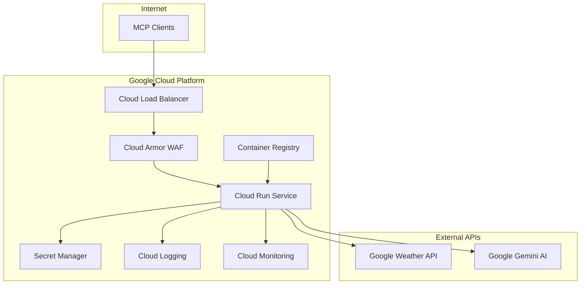

### Cloud Run 部署優勢

1. **無伺服器架構**
   - 自動擴展（0 到 N 個實例）
   - 按使用量計費
   - 零管理開銷

2. **整合 Google Cloud 服務**
   - Secret Manager 管理 API 金鑰
   - Cloud Logging 自動日誌收集
   - Cloud Monitoring 效能監控

3. **全球部署**
   - 支援多區域部署
   - 自動負載平衡
   - 低延遲服務

### Cloud Run 部署流程

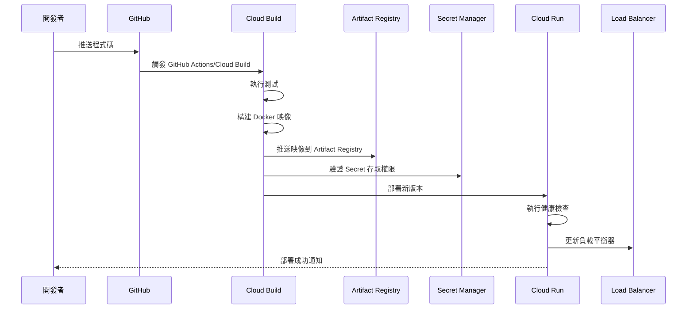

### 部署命令範例

```bash
# 1. 構建 Docker 映像
gcloud builds submit --tag gcr.io/PROJECT_ID/smart-weather-mcp

# 2. 部署到 Cloud Run
gcloud run deploy smart-weather-mcp \
  --image gcr.io/PROJECT_ID/smart-weather-mcp \
  --platform managed \
  --region asia-east1 \
  --port 8080 \
  --memory 1Gi \
  --cpu 1 \
  --min-instances 0 \
  --max-instances 10 \
  --concurrency 100 \
  --timeout 300 \
  --set-env-vars "NODE_ENV=production,GEMINI_MODEL=gemini-2.5-flash-lite" \
  --set-secrets "GOOGLE_WEATHER_API_KEY=weather-api-key:latest" \
  --set-secrets "GOOGLE_GEOCODING_API_KEY=geocoding-api-key:latest" \
  --set-secrets "GOOGLE_GEMINI_API_KEY=gemini-api-key:latest" \
  --allow-unauthenticated

# 3. 驗證部署
gcloud run services describe smart-weather-mcp --region asia-east1
```

### 服務監控

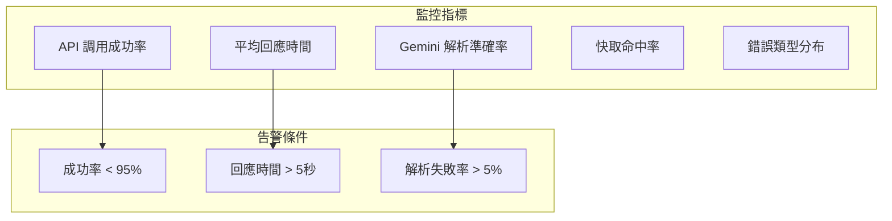

## 測試策略

### 測試涵蓋範圍

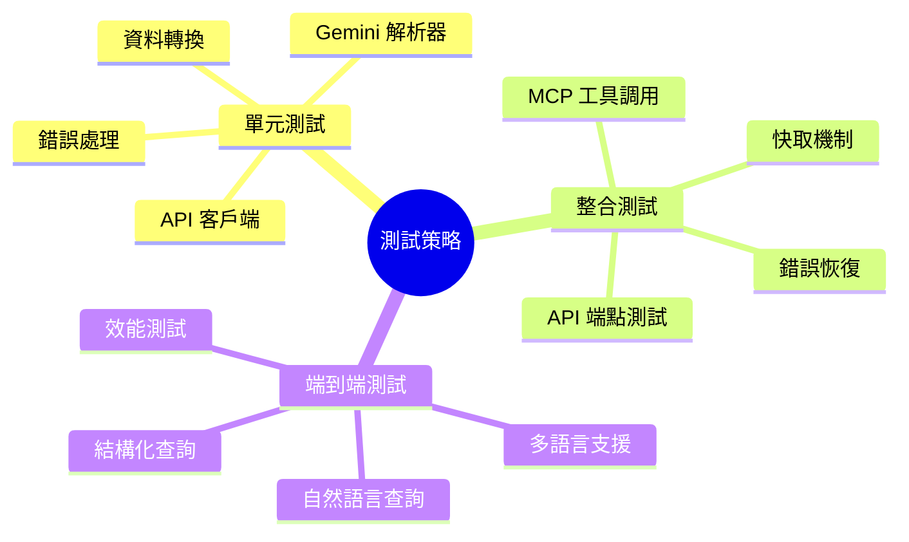

### 測試案例

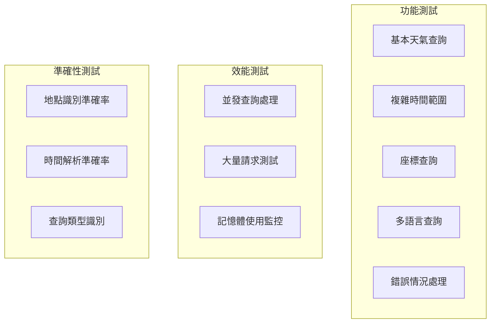

## 驗收標準

### 功能需求

1. **工具可用性** = 100%
   - `search_weather` - 智能天氣查詢工具正常運作（整合所有天氣類型：當前、預報、歷史）
   - `find_location` - 地點發現與確認工具正常運作
   - `get_weather_advice` - 個人化天氣建議工具正常運作
   - 所有工具參數驗證正確執行
   - 統一的錯誤處理適當回應
   - 符合 Shopify Storefront MCP 設計哲學：3 個用戶意圖導向工具

2. **API 整合完整性**
   - [Current Conditions API](https://developers.google.com/maps/documentation/weather/current-conditions) 正確整合
   - [Daily Forecast API](https://developers.google.com/maps/documentation/weather/daily-forecast) 正確整合
   - [Hourly Forecast API](https://developers.google.com/maps/documentation/weather/hourly-forecast) 正確整合
   - [Hourly History API](https://developers.google.com/maps/documentation/weather/hourly-history) 正確整合
   - Google Geocoding API 正確整合
   - 統一的回應格式和錯誤處理

3. **多語言支援**
   - 支援繁體中文、英文、日文回應
   - 正確的預設語言設定
   - 地點搜尋支援多語言輸入

### 非功能需求

1. **效能指標**
   - 平均回應時間 ≤ 1.5 秒 (Gemini 2.5 Flash-Lite 優勢)
   - 95% 請求回應時間 ≤ 2.5 秒
   - 支援 50 個並發請求 (輕量模型優勢)
   - 冷啟動時間 ≤ 800ms

2. **可靠性指標**
   - 系統可用性 ≥ 99.5%
   - API 調用成功率 ≥ 95%
   - 快取命中率 ≥ 60%
   - 自動故障轉移和恢復

3. **安全性需求**
   - API 金鑰透過 Secret Manager 安全存儲
   - Cloud Armor 防護 DDoS 攻擊
   - 服務間通訊使用 TLS 1.3
   - IAM 服務帳戶最小權限原則
   - 請求頻率限制和配額管理
   - 錯誤資訊不洩露敏感資料

## 未來發展方向

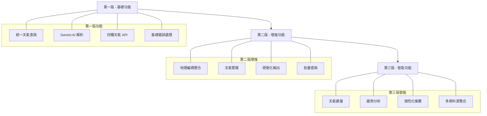

## 結論

這個 Smart Weather MCP Server 通過 3 個用戶意圖導向的工具提供了完整的天氣查詢解決方案，結合 AI 的自然語言理解能力和多樣化的天氣資料來源，為 AI 助手提供了強大而易用的天氣資訊查詢能力。採用模組化設計，支援未來彈性切換不同的天氣資料供應商。

---

## 參考資料

### 核心技術文檔

- [Model Context Protocol Specification](https://modelcontextprotocol.io/specification)
- [MCP TypeScript SDK](https://github.com/modelcontextprotocol/typescript-sdk)
- [Shopify Storefront MCP Design Philosophy](https://shopify.dev/docs/apps/build/storefront-mcp/servers/storefront)

### Google Cloud Platform

- [Google Cloud Run Documentation](https://cloud.google.com/run/docs)
- [Google Cloud Run MCP Server Hosting](https://cloud.google.com/run/docs/host-mcp-servers)
- [Google Cloud Run MCP Tutorial](https://cloud.google.com/run/docs/tutorials/deploy-remote-mcp-server)
- [Google Secret Manager](https://cloud.google.com/secret-manager/docs)
- [Google Cloud Build](https://cloud.google.com/build/docs)

### Google APIs

- [Google Maps Platform Weather API](https://developers.google.com/maps/documentation/weather)
- [Google Maps Current Conditions API](https://developers.google.com/maps/documentation/weather/current-conditions)
- [Google Maps Daily Forecast API](https://developers.google.com/maps/documentation/weather/daily-forecast)
- [Google Maps Hourly Forecast API](https://developers.google.com/maps/documentation/weather/hourly-forecast)
- [Google Maps Hourly History API](https://developers.google.com/maps/documentation/weather/hourly-history)
- [Google Maps Geocoding API](https://developers.google.com/maps/documentation/geocoding)
- [Google Gemini 2.5 Flash-Lite Model](https://cloud.google.com/vertex-ai/generative-ai/docs/models/gemini/2-5-flash-lite)

### MCP 客戶端整合

- [n8n MCP Client Tool Documentation](https://docs.n8n.io/integrations/builtin/cluster-nodes/sub-nodes/n8n-nodes-langchain.toolmcp/)

### 開發工具與框架

- [Express.js Documentation](https://expressjs.com/)
- [TypeScript Handbook](https://www.typescriptlang.org/docs/)
- [Node.js Documentation](https://nodejs.org/docs/)
- [Docker Documentation](https://docs.docker.com/)
- [GitHub Actions Documentation](https://docs.github.com/en/actions)

---

*基於 [MCP TypeScript SDK 1.17.1](https://github.com/modelcontextprotocol/typescript-sdk) 和 [Google Cloud Run MCP 最佳實踐](https://cloud.google.com/run/docs/host-mcp-servers) 開發*
