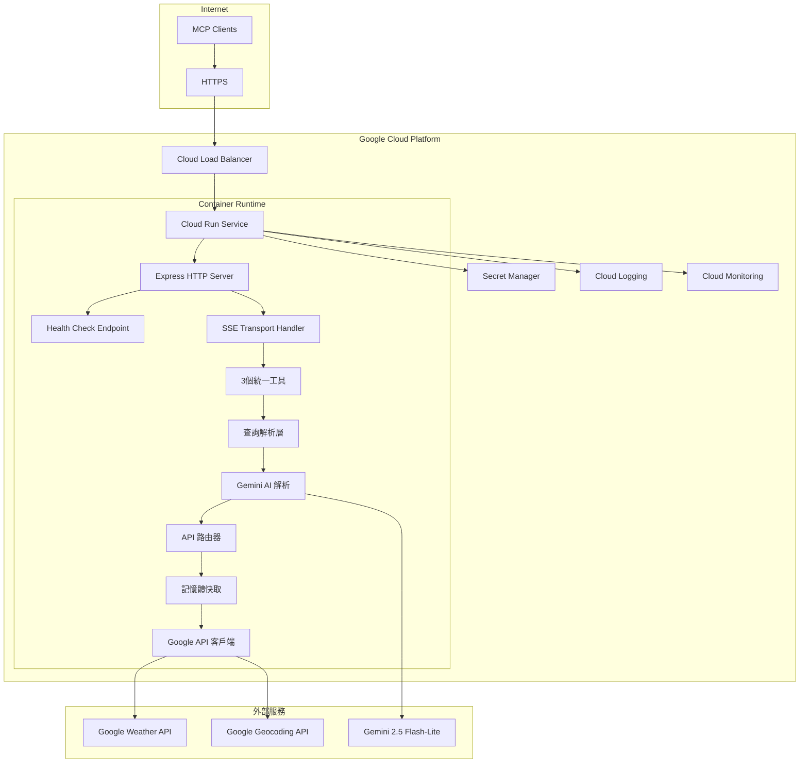
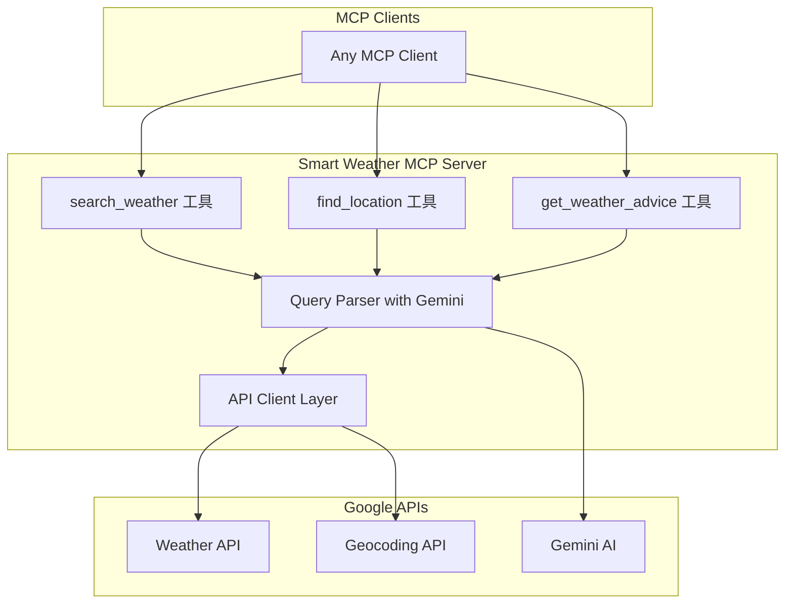
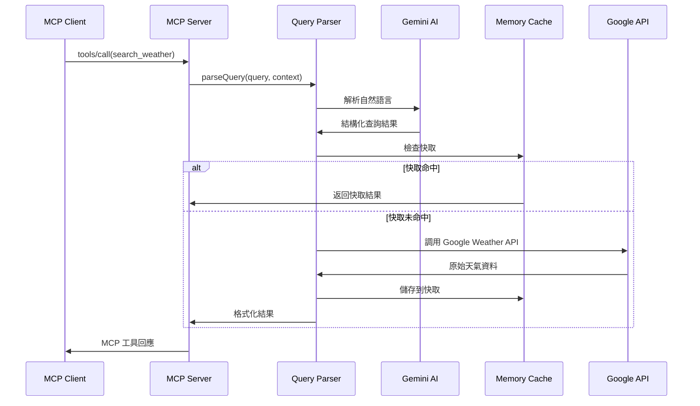
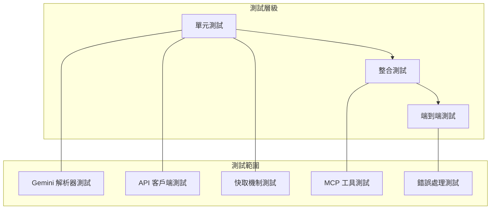
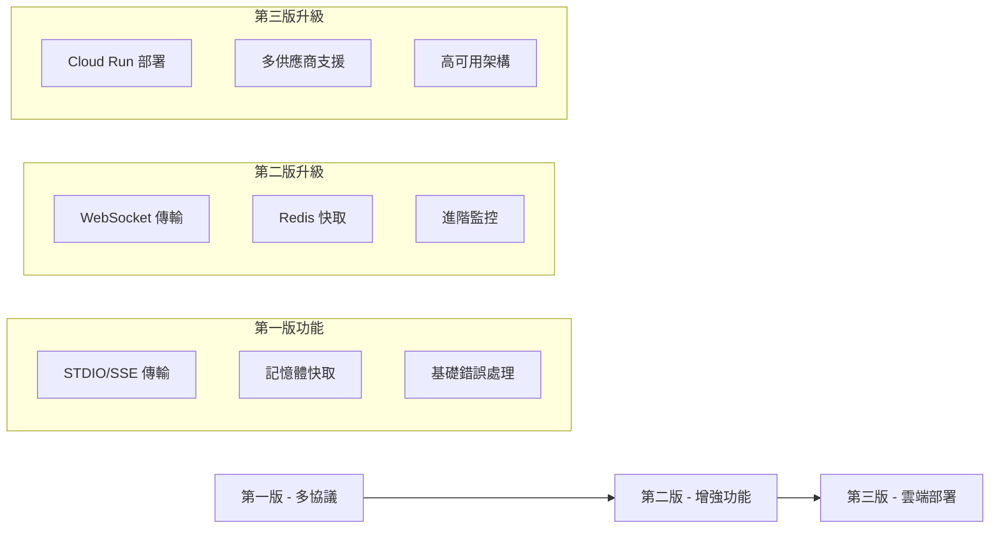

# 技術規格文件：Smart Weather MCP Server

## 1. 專案概述

### 1.1 背景與目標

開發一個基於 Model Context Protocol (MCP) 的天氣查詢服務，讓 AI 助手能夠透過自然語言查詢全球天氣資訊。採用 Shopify Storefront MCP 設計哲學，提供用戶意圖導向的智能工具。

**選擇 MCP 的原因**：

- 標準化的 AI 工具整合協議
- 支援實時雙向通信
- 與主流 AI 客戶端（Claude Desktop、Cursor 等）原生兼容
- 統一的工具發現和調用機制

### 1.2 功能範圍

**核心功能**：

- 3個用戶意圖導向的工具：`search_weather`、`find_location`、`get_weather_advice`
- 智能自然語言查詢解析（透過 Gemini AI）
- 全球天氣資料查詢（Google Weather API）
- 多語言支援（繁體中文、英文、日文）

**預期使用場景**：

- AI 助手中的天氣查詢對話
- 開發者工作流程中的天氣資訊整合
- 個人化天氣建議和行動指導

## 2. 系統架構

### 2.1 整體架構



### 2.2 主要組件

| 組件 | 職責 | 實現方式 |
|------|------|----------|
| **Express HTTP Server** | HTTP 服務和路由 | Express.js 4.18+ |
| **Health Check Endpoint** | Cloud Run 健康檢查 | HTTP GET /health |
| **SSE Transport Handler** | MCP 協議通信 | MCP TypeScript SDK |
| **統一工具處理器** | 3個工具的統一入口 | TypeScript 類別 |
| **查詢解析器** | 自然語言理解 | Gemini API 整合 |
| **API 路由器** | 智能 API 選擇 | 條件路由邏輯 |
| **記憶體快取** | 回應快取管理 | JavaScript Map |
| **Secret Manager 客戶端** | 密鑰管理 | @google-cloud/secret-manager |
| **Google API 客戶端** | 外部 API 調用 | Axios HTTP 客戶端 |

## 3. 技術選擇與依賴

### 3.1 核心技術堆疊

```json
{
  "runtime": "Node.js 18+ (Container)",
  "language": "TypeScript 5.0+",
  "platform": "Google Cloud Run",
  "mcp_sdk": "@modelcontextprotocol/sdk@^1.17.1",
  "http_server": "express@^4.18.0",
  "http_client": "axios@^1.6.0",
  "secret_manager": "@google-cloud/secret-manager@^5.0.0",
  "cors": "cors@^2.8.5",
  "ai_provider": "Google Gemini 2.5 Flash-Lite",
  "weather_api": "Google Maps Platform Weather API",
  "transport": "HTTP/SSE only"
}
```

### 3.2 依賴庫

```json
// package.json 核心依賴（Cloud Run 優化）
{
  "name": "smart-weather-mcp-server",
  "description": "智能天氣查詢 MCP Server，部署在 Google Cloud Run",
  "version": "1.0.0",
  "type": "module",
  "engines": {
    "node": ">=18.0.0"
  },
  "scripts": {
    "build": "tsc",
    "start": "node dist/server.js",
    "dev": "tsx src/server.ts",
    "test": "jest",
    "docker:build": "docker build -t smart-weather-mcp .",
    "docker:run": "docker run -p 8080:8080 smart-weather-mcp"
  },
  "dependencies": {
    "@modelcontextprotocol/sdk": "^1.17.1",
    "@google-cloud/secret-manager": "^5.0.0",
    "express": "^4.18.0",
    "cors": "^2.8.5",
    "axios": "^1.6.0",
    "dotenv": "^16.3.1"
  },
  "devDependencies": {
    "@types/node": "^20.0.0",
    "@types/express": "^4.17.0",
    "@types/cors": "^2.8.17",
    "typescript": "^5.0.0",
    "tsx": "^4.0.0",
    "jest": "^29.0.0",
    "@types/jest": "^29.0.0"
  }
}
```

### 3.3 實現策略

採用模組化設計，支援未來多供應商切換：

```typescript
// 模組化服務實現（初期使用 Google，未來可擴展）
class WeatherService {
  async getCurrentWeather(location: string): Promise<WeatherData> { ... }
  async getForecast(location: string, days: number): Promise<ForecastData> { ... }
  async getHistoricalWeather(location: string, date: Date): Promise<WeatherData> { ... }
}

class AIQueryParser {
  async parseQuery(query: string, context?: string): Promise<ParsedQuery> { ... }
}

class GeocodingService {
  async searchLocation(query: string): Promise<Location[]> { ... }
}
```

**依賴說明**：

- `@modelcontextprotocol/sdk`：官方 MCP SDK，提供 SSE 傳輸支援
- `@google-cloud/secret-manager`：Google Cloud Secret Manager 客戶端
- `express`：HTTP 服務器，實現 Cloud Run HTTP 端點
- `cors`：跨域資源共享支援
- `axios`：HTTP 客戶端，用於調用外部 APIs
- `dotenv`：環境變數管理（開發環境）

**Cloud Run 實現策略**：

- **容器化部署**：使用 Docker 容器確保環境一致性
- **無伺服器架構**：利用 Cloud Run 自動擴展和按使用量計費
- **安全密鑰管理**：透過 Secret Manager 安全存取 API 密鑰
- **健康檢查整合**：實現 Cloud Run 要求的健康檢查端點
- **效能優化**：針對冷啟動和記憶體使用進行優化

## 4. 智能解析架構設計

### 4.1 整合 Gemini AI 解析層

基於 Shopify Storefront MCP 的 `query` + `context` 純文字參數設計，需要智能解析層：



### 4.2 設計優勢

- **自然語言支援** - 支援純文字查詢如 "台北今天天氣"
- **靈活的上下文理解** - 透過 context 參數提供偏好設定
- **符合 Storefront MCP 模式** - 使用相同的參數結構
- **智能解析** - Gemini 2.5 Flash-Lite 理解複雜查詢意圖
- **統一介面** - 所有工具都使用相同的參數模式

## 5. MCP 功能實現

### 5.1 工具定義

基於 [MCP TypeScript SDK](https://github.com/modelcontextprotocol/typescript-sdk) 的工具註冊模式：

```typescript
import { Server } from "@modelcontextprotocol/sdk/server/index.js";
import { StdioServerTransport } from "@modelcontextprotocol/sdk/server/stdio.js";

const server = new Server(
  {
    name: "google-weather-mcp-server",
    version: "1.0.0",
  },
  {
    capabilities: {
      tools: {},
    },
  }
);

// 工具 1: 智能天氣查詢
server.setRequestHandler("tools/call", async (request) => {
  if (request.params.name === "search_weather") {
    const { query, context } = request.params.arguments as {
      query: string;
      context?: string;
    };
    
    // 智能解析 -> API 路由 -> 格式化回應
    const result = await weatherService.searchWeather(query, context);
    
    return {
      content: [
        {
          type: "text",
          text: result.formattedResponse,
        },
      ],
    };
  }
});
```

### 5.2 工具詳細規格

#### search_weather 工具

```typescript
{
  name: "search_weather",
  description: "智能天氣查詢工具，支援當前、預報、歷史天氣查詢",
  inputSchema: {
    type: "object",
    properties: {
      query: {
        type: "string",
        description: "自然語言天氣查詢（如：台北今天天氣、東京下週預報）"
      },
      context: {
        type: "string", 
        description: "偏好設定（如：攝氏溫度、繁體中文、詳細程度）",
        optional: true
      }
    },
    required: ["query"]
  }
}
```

#### find_location 工具

```typescript
{
  name: "find_location",
  description: "地點發現與確認工具，解決地名模糊問題",
  inputSchema: {
    type: "object",
    properties: {
      query: {
        type: "string",
        description: "地點搜尋查詢（如：台北101、新竹科學園區）"
      },
      context: {
        type: "string",
        description: "地理偏好（如：台灣地區優先、返回詳細地址）",
        optional: true
      }
    },
    required: ["query"]
  }
}
```

#### get_weather_advice 工具

```typescript
{
  name: "get_weather_advice", 
  description: "基於天氣提供個人化建議工具",
  inputSchema: {
    type: "object",
    properties: {
      query: {
        type: "string",
        description: "活動決策查詢（如：適合出門嗎、該穿什麼、需要帶傘嗎）"
      },
      context: {
        type: "string",
        description: "個人偏好和活動類型（如：戶外運動、商務會議）",
        optional: true
      }
    },
    required: ["query"]
  }
}
```

## 6. 安全性和用戶授權

### 6.1 用戶授權策略

根據 [MCP 規格](https://modelcontextprotocol.io/specification/2025-06-18)的安全要求：

```typescript
// MCP 標準授權機制
class AuthorizationManager {
  private authorizedTools = new Set<string>();
  
  async requestAuthorization(toolName: string): Promise<boolean> {
    if (this.authorizedTools.has(toolName)) {
      return true; // 已授權
    }
    
    // 工具授權由 MCP 客戶端處理
    console.error(`工具授權請求: ${toolName}`);
    this.authorizedTools.add(toolName);
    return true;
  }
}
```

### 6.2 安全考量

- **工具授權**：每個 MCP 客戶端控制工具的使用權限
- **傳輸安全**：支援 TLS 加密的 HTTP/SSE 連接
- **資料隱私**：不儲存用戶查詢歷史，快取資料不含個人識別資訊

## 7. 數據流設計

### 7.1 請求處理流程



### 7.2 錯誤處理流程

```typescript
// 錯誤處理策略
class WeatherServiceError extends Error {
  constructor(
    message: string,
    public code: string,
    public statusCode?: number,
    public originalError?: Error
  ) {
    super(message);
  }
}

// Google API 錯誤直接對應
const handleGoogleAPIError = (error: any): WeatherServiceError => {
  if (error.response?.status === 400) {
    return new WeatherServiceError(
      "查詢參數錯誤，請檢查地點名稱或時間範圍",
      "INVALID_QUERY",
      400,
      error
    );
  }
  
  if (error.response?.status === 401) {
    return new WeatherServiceError(
      "API 金鑰認證失敗",
      "AUTH_FAILED", 
      401,
      error
    );
  }
  
  if (error.response?.status === 403) {
    return new WeatherServiceError(
      "API 配額已用完或權限不足",
      "QUOTA_EXCEEDED",
      403,
      error
    );
  }
  
  if (error.response?.status === 404) {
    return new WeatherServiceError(
      "找不到指定地點，請嘗試更具體的地名",
      "LOCATION_NOT_FOUND",
      404,
      error
    );
  }
  
  if (error.response?.status === 429) {
    return new WeatherServiceError(
      "請求頻率過高，請稍後再試",
      "RATE_LIMITED",
      429,
      error
    );
  }
  
  return new WeatherServiceError(
    "天氣服務暫時不可用，請稍後再試",
    "SERVICE_UNAVAILABLE",
    500,
    error
  );
};
```

## 8. Gemini AI 整合實現

### 8.1 Gemini AI 整合

```typescript
import axios from 'axios';

class GeminiQueryParser {
  private apiKey: string;
  private model = 'gemini-2.5-flash-lite';
  
  async parseQuery(query: string, context?: string): Promise<ParsedQuery> {
    const prompt = this.buildPrompt(query, context);
    
    try {
      const response = await axios.post(
        `https://generativelanguage.googleapis.com/v1beta/models/${this.model}:generateContent`,
        {
          contents: [{
            parts: [{ text: prompt }]
          }],
          generationConfig: {
            temperature: 0.1,
            candidateCount: 1,
            maxOutputTokens: 1024,
          }
        },
        {
          headers: {
            'Content-Type': 'application/json',
            'x-goog-api-key': this.apiKey
          },
          timeout: 5000
        }
      );
      
      return this.parseGeminiResponse(response.data);
    } catch (error) {
      throw new WeatherServiceError(
        "查詢解析失敗",
        "PARSE_FAILED",
        500,
        error
      );
    }
  }
  
  private buildPrompt(query: string, context?: string): string {
    return `
請解析以下天氣查詢，返回 JSON 格式：

查詢: "${query}"
上下文: "${context || '無'}"

請返回以下格式的 JSON：
{
  "location": "地點名稱",
  "queryType": "current|forecast|history|advice",
  "timeScope": "具體時間範圍",
  "weatherFocus": "關注的天氣要素",
  "userPreferences": {
    "language": "zh-TW|en|ja",
    "temperatureUnit": "celsius|fahrenheit",
    "detailLevel": "basic|detailed"
  }
}
    `.trim();
  }
}
```

### 8.2 智能路由器

```typescript
class WeatherQueryRouter {
  route(parsedQuery: ParsedQuery): GoogleAPIEndpoint {
    switch (parsedQuery.queryType) {
      case 'current':
        return 'current-conditions';
      case 'forecast':
        return parsedQuery.timeScope.includes('hour') 
          ? 'hourly-forecast' 
          : 'daily-forecast';
      case 'history':
        return 'hourly-history';
      case 'advice':
        return 'current-conditions'; // 建議需要當前天氣
      default:
        return 'current-conditions';
    }
  }
}
```

## 9. 快取實現

### 9.1 記憶體快取策略

```typescript
interface CacheEntry<T> {
  data: T;
  timestamp: number;
  ttl: number;
}

class MemoryCache {
  private cache = new Map<string, CacheEntry<any>>();
  
  // 快取 TTL 設定（秒）
  private readonly TTL_CONFIG = {
    current: 300,      // 當前天氣: 5分鐘
    forecast: 1800,    // 預報資料: 30分鐘  
    history: 3600,     // 歷史資料: 1小時
    location: 86400,   // 地點資訊: 24小時
  };
  
  set<T>(key: string, data: T, type: keyof typeof this.TTL_CONFIG): void {
    const ttl = this.TTL_CONFIG[type];
    this.cache.set(key, {
      data,
      timestamp: Date.now(),
      ttl: ttl * 1000 // 轉換為毫秒
    });
  }
  
  get<T>(key: string): T | null {
    const entry = this.cache.get(key);
    if (!entry) return null;
    
    if (Date.now() - entry.timestamp > entry.ttl) {
      this.cache.delete(key);
      return null;
    }
    
    return entry.data;
  }
  
  generateKey(type: string, location: string, params?: any): string {
    const baseKey = `${type}:${location}`;
    if (params) {
      const paramStr = JSON.stringify(params);
      return `${baseKey}:${Buffer.from(paramStr).toString('base64')}`;
    }
    return baseKey;
  }
}
```

## 10. 部署與運行

### 10.1 本地開發設置

```bash
# 環境設置
npm init -y
npm install @modelcontextprotocol/sdk axios dotenv zod
npm install -D @types/node typescript tsx jest

# 環境變數檔案 (.env)
GOOGLE_WEATHER_API_KEY=your_weather_api_key
GOOGLE_GEOCODING_API_KEY=your_geocoding_api_key  
GOOGLE_GEMINI_API_KEY=your_gemini_api_key
GEMINI_MODEL=gemini-2.5-flash-lite
DEFAULT_LANGUAGE=zh-TW
DEFAULT_UNITS=celsius
CACHE_TTL_SECONDS=300
```

### 10.2 Cloud Run HTTP 服務器實現

基於 [Google Cloud Run MCP 最佳實踐](https://cloud.google.com/run/docs/host-mcp-servers)：

```typescript
// server.ts - Cloud Run 專用實現
import { Server } from "@modelcontextprotocol/sdk/server/index.js";
import { SSEServerTransport } from "@modelcontextprotocol/sdk/server/sse.js";
import { SecretManagerServiceClient } from "@google-cloud/secret-manager";
import express from "express";
import cors from "cors";

async function main() {
  const app = express();
  
  // Cloud Run 基本配置
  app.use(express.json());
  app.use(cors({
    origin: true,
    credentials: true
  }));
  
  // Secret Manager 客戶端
  const secretClient = new SecretManagerServiceClient();
  
  // 從 Secret Manager 載入 API 密鑰
  const secrets = await loadSecrets(secretClient);
  
  // MCP Server 初始化
  const server = new Server({
    name: "smart-weather-mcp-server",
    version: "1.0.0"
  }, {
    capabilities: {
      tools: {}
    }
  });
  
  // 註冊工具處理器
  setupToolHandlers(server, secrets);
  
  // 健康檢查端點（Cloud Run 要求）
  app.get('/health', (req, res) => {
    res.status(200).json({
      status: 'healthy',
      timestamp: new Date().toISOString(),
      version: '1.0.0'
    });
  });
  
  // 儲存 SSE 連接
  const transports: Record<string, SSEServerTransport> = {};
  
  // SSE 端點
  app.get('/sse', async (req, res) => {
    try {
      const transport = new SSEServerTransport('/messages', res);
      transports[transport.sessionId] = transport;
      
      res.on("close", () => {
        delete transports[transport.sessionId];
        console.log(`SSE connection closed: ${transport.sessionId}`);
      });
      
      await server.connect(transport);
      console.log(`SSE connection established: ${transport.sessionId}`);
      
    } catch (error) {
      console.error('SSE connection error:', error);
      res.status(500).send('SSE connection failed');
    }
  });
  
  // 訊息處理端點
  app.post('/messages', async (req, res) => {
    const sessionId = req.query.sessionId as string;
    const transport = transports[sessionId];
    
    if (transport) {
      try {
        await transport.handlePostMessage(req, res, req.body);
      } catch (error) {
        console.error('Message handling error:', error);
        res.status(500).send('Message handling failed');
      }
    } else {
      res.status(400).send('No transport found for sessionId');
    }
  });
  
  // 根目錄端點
  app.get('/', (req, res) => {
    res.json({
      name: 'Smart Weather MCP Server',
      version: '1.0.0',
      endpoints: {
        health: '/health',
        sse: '/sse',
        messages: '/messages'
      }
    });
  });
  
  // 啟動服務器
  const port = process.env.PORT || 8080;
  app.listen(port, () => {
    console.log(`Smart Weather MCP Server running on port ${port}`);
    console.log(`Health check: http://localhost:${port}/health`);
    console.log(`SSE endpoint: http://localhost:${port}/sse`);
  });
}

// Secret Manager 密鑰載入
async function loadSecrets(client: SecretManagerServiceClient) {
  const project = process.env.GOOGLE_CLOUD_PROJECT;
  
  const secrets = {
    weatherApiKey: await getSecret(client, `projects/${project}/secrets/weather-api-key/versions/latest`),
    geocodingApiKey: await getSecret(client, `projects/${project}/secrets/geocoding-api-key/versions/latest`),
    geminiApiKey: await getSecret(client, `projects/${project}/secrets/gemini-api-key/versions/latest`)
  };
  
  return secrets;
}

async function getSecret(client: SecretManagerServiceClient, name: string) {
  try {
    const [version] = await client.accessSecretVersion({ name });
    return version.payload?.data?.toString();
  } catch (error) {
    console.error(`Failed to load secret ${name}:`, error);
    throw error;
  }
}

main().catch(console.error);
```

### 10.3 Dockerfile 配置

```dockerfile
# Dockerfile
FROM node:18-alpine

# 設定工作目錄
WORKDIR /app

# 複製 package files
COPY package*.json ./
COPY tsconfig.json ./

# 安裝依賴
RUN npm ci --only=production

# 複製源代碼
COPY src/ ./src/

# 建置應用
RUN npm run build

# 移除開發依賴
RUN npm prune --production

# 建立非 root 用戶
RUN addgroup -g 1001 -S nodejs
RUN adduser -S nextjs -u 1001
USER nextjs

# 暴露端口
EXPOSE 8080

# 設定健康檢查
HEALTHCHECK --interval=30s --timeout=3s --start-period=5s --retries=3 \
  CMD curl -f http://localhost:8080/health || exit 1

# 啟動應用
CMD ["npm", "start"]
```

**Cloud Run 實現說明**：

- **專用於 HTTP/SSE**：移除 STDIO 支援，專注於 Web 傳輸
- **健康檢查整合**：提供 `/health` 端點供 Cloud Run 監控
- **Secret Manager 整合**：安全載入 API 密鑰
- **錯誤處理增強**：完整的錯誤處理和日誌記錄
- **容器優化**：使用 Alpine Linux 減少映像大小

### 10.4 CI/CD 配置

#### GitHub Actions 部署配置

```yaml
# .github/workflows/deploy.yml
name: Deploy to Cloud Run

on:
  push:
    branches: [ main ]
  pull_request:
    branches: [ main ]

env:
  PROJECT_ID: ${{ secrets.GCP_PROJECT_ID }}
  SERVICE_NAME: smart-weather-mcp
  REGION: asia-east1

jobs:
  test:
    runs-on: ubuntu-latest
    steps:
    - uses: actions/checkout@v3
    
    - name: Setup Node.js
      uses: actions/setup-node@v3
      with:
        node-version: '18'
        cache: 'npm'
    
    - name: Install dependencies
      run: npm ci
    
    - name: Run tests
      run: npm test
    
    - name: Build application
      run: npm run build

  deploy:
    needs: test
    runs-on: ubuntu-latest
    if: github.ref == 'refs/heads/main'
    
    steps:
    - uses: actions/checkout@v3
    
    - name: Setup Google Cloud SDK
      uses: google-github-actions/setup-gcloud@v1
      with:
        service_account_key: ${{ secrets.GCP_SA_KEY }}
        project_id: ${{ secrets.GCP_PROJECT_ID }}
    
    - name: Configure Docker
      run: gcloud auth configure-docker
    
    - name: Build and push Docker image
      run: |
        docker build -t gcr.io/$PROJECT_ID/$SERVICE_NAME:$GITHUB_SHA .
        docker push gcr.io/$PROJECT_ID/$SERVICE_NAME:$GITHUB_SHA
    
    - name: Deploy to Cloud Run
      run: |
        gcloud run deploy $SERVICE_NAME \
          --image gcr.io/$PROJECT_ID/$SERVICE_NAME:$GITHUB_SHA \
          --platform managed \
          --region $REGION \
          --port 8080 \
          --memory 1Gi \
          --cpu 1 \
          --min-instances 0 \
          --max-instances 10 \
          --concurrency 100 \
          --timeout 300 \
          --set-env-vars "NODE_ENV=production" \
          --set-secrets "GOOGLE_WEATHER_API_KEY=weather-api-key:latest" \
          --set-secrets "GOOGLE_GEOCODING_API_KEY=geocoding-api-key:latest" \
          --set-secrets "GOOGLE_GEMINI_API_KEY=gemini-api-key:latest" \
          --allow-unauthenticated
```

#### Cloud Build 配置

```yaml
# cloudbuild.yaml
steps:
  # Install dependencies
  - name: 'node:18'
    entrypoint: 'npm'
    args: ['ci']

  # Run tests
  - name: 'node:18'
    entrypoint: 'npm'
    args: ['test']

  # Build application
  - name: 'node:18'
    entrypoint: 'npm'
    args: ['run', 'build']

  # Build Docker image
  - name: 'gcr.io/cloud-builders/docker'
    args: ['build', '-t', 'gcr.io/$PROJECT_ID/smart-weather-mcp:$COMMIT_SHA', '.']

  # Push to Container Registry
  - name: 'gcr.io/cloud-builders/docker'
    args: ['push', 'gcr.io/$PROJECT_ID/smart-weather-mcp:$COMMIT_SHA']

  # Deploy to Cloud Run
  - name: 'gcr.io/cloud-builders/gcloud'
    args:
    - 'run'
    - 'deploy'
    - 'smart-weather-mcp'
    - '--image=gcr.io/$PROJECT_ID/smart-weather-mcp:$COMMIT_SHA'
    - '--region=asia-east1'
    - '--platform=managed'
    - '--port=8080'
    - '--memory=1Gi'
    - '--cpu=1'
    - '--min-instances=0'
    - '--max-instances=10'
    - '--concurrency=100'
    - '--timeout=300'
    - '--set-env-vars=NODE_ENV=production'
    - '--set-secrets=GOOGLE_WEATHER_API_KEY=weather-api-key:latest'
    - '--set-secrets=GOOGLE_GEOCODING_API_KEY=geocoding-api-key:latest'
    - '--set-secrets=GOOGLE_GEMINI_API_KEY=gemini-api-key:latest'
    - '--allow-unauthenticated'

images:
- 'gcr.io/$PROJECT_ID/smart-weather-mcp:$COMMIT_SHA'

options:
  logging: CLOUD_LOGGING_ONLY
```

### 10.5 部署腳本

```bash
#!/bin/bash
# deploy.sh - 本地部署腳本

set -e

PROJECT_ID=${1:-"your-project-id"}
REGION=${2:-"asia-east1"}
SERVICE_NAME="smart-weather-mcp"

echo "Deploying Smart Weather MCP Server to Cloud Run..."
echo "Project: $PROJECT_ID"
echo "Region: $REGION"

# 1. 建置 Docker 映像
echo "Building Docker image..."
gcloud builds submit --tag gcr.io/$PROJECT_ID/$SERVICE_NAME

# 2. 部署到 Cloud Run
echo "Deploying to Cloud Run..."
gcloud run deploy $SERVICE_NAME \
  --image gcr.io/$PROJECT_ID/$SERVICE_NAME \
  --platform managed \
  --region $REGION \
  --port 8080 \
  --memory 1Gi \
  --cpu 1 \
  --min-instances 0 \
  --max-instances 10 \
  --concurrency 100 \
  --timeout 300 \
  --set-env-vars "NODE_ENV=production,GEMINI_MODEL=gemini-2.5-flash-lite" \
  --set-secrets "GOOGLE_WEATHER_API_KEY=weather-api-key:latest" \
  --set-secrets "GOOGLE_GEOCODING_API_KEY=geocoding-api-key:latest" \
  --set-secrets "GOOGLE_GEMINI_API_KEY=gemini-api-key:latest" \
  --allow-unauthenticated

# 3. 驗證部署
echo "Verifying deployment..."
SERVICE_URL=$(gcloud run services describe $SERVICE_NAME --region $REGION --format 'value(status.url)')
echo "Service deployed at: $SERVICE_URL"

# 健康檢查
echo "Performing health check..."
curl -f $SERVICE_URL/health || echo "Health check failed"

echo "Deployment completed successfully!"
```

## 11. 測試策略

### 11.1 測試架構



### 11.2 關鍵測試案例

```typescript
// 單元測試範例
describe('GeminiQueryParser', () => {
  test('解析當前天氣查詢', async () => {
    const parser = new GeminiQueryParser(mockApiKey);
    const result = await parser.parseQuery('台北今天天氣如何？');
    
    expect(result.location).toBe('台北');
    expect(result.queryType).toBe('current');
    expect(result.userPreferences.language).toBe('zh-TW');
  });
  
  test('解析預報查詢', async () => {
    const result = await parser.parseQuery('東京下週天氣預報');
    
    expect(result.location).toBe('東京');
    expect(result.queryType).toBe('forecast');
    expect(result.timeScope).toContain('week');
  });
});

// 整合測試範例  
describe('WeatherService Integration', () => {
  test('完整查詢流程', async () => {
    const service = new WeatherService();
    const result = await service.searchWeather('台北今天天氣');
    
    expect(result.success).toBe(true);
    expect(result.data.location).toBeDefined();
    expect(result.data.temperature).toBeDefined();
  });
});
```

## 12. 監控與效能

### 12.1 效能指標

| 指標 | 目標值 | 監控方式 |
|------|--------|----------|
| 平均回應時間 | ≤ 1.5秒 | 請求計時 |
| Gemini 解析時間 | ≤ 500ms | API 計時 |
| 快取命中率 | ≥ 60% | 快取統計 |
| API 成功率 | ≥ 95% | 錯誤統計 |

### 12.2 日誌策略

```typescript
// 簡單日誌實現
class Logger {
  private logLevel = process.env.LOG_LEVEL || 'info';
  
  info(message: string, meta?: any): void {
    console.error(`[INFO] ${new Date().toISOString()} ${message}`, meta || '');
  }
  
  error(message: string, error?: Error): void {
    console.error(`[ERROR] ${new Date().toISOString()} ${message}`, error?.stack || '');
  }
  
  warn(message: string, meta?: any): void {
    console.error(`[WARN] ${new Date().toISOString()} ${message}`, meta || '');
  }
}
```

## 13. 未來擴展考慮

### 13.1 升級路徑



### 13.2 重構考量

當未來需要支援多供應商時，可考慮以下重構策略：

- **階段性重構**：先將現有 Google 實現封裝成服務類別
- **配置驅動**：透過環境變數或配置檔案選擇供應商
- **漸進式遷移**：保持現有 API 不變，內部實現逐步抽象化

這種方式避免過早優化，讓初期開發更專注於核心功能實現。

## 14. 驗收標準

### 14.1 功能需求驗收

- [ ] 3個 MCP 工具正常註冊和調用
- [ ] Gemini AI 查詢解析準確率 ≥ 90%
- [ ] Google Weather API 整合完整
- [ ] 多語言回應支援（中、英、日）
- [ ] 記憶體快取機制運作正常

### 14.2 非功能需求驗收

- [ ] 平均回應時間 ≤ 1.5秒
- [ ] Cloud Run 冷啟動時間 ≤ 2秒
- [ ] API 調用成功率 ≥ 95%
- [ ] 快取命中率 ≥ 60%
- [ ] SSE 傳輸穩定運行
- [ ] 健康檢查端點正常回應
- [ ] Secret Manager 密鑰載入成功
- [ ] 容器映像建置成功
- [ ] Cloud Run 自動擴展正常運作
- [ ] 錯誤處理涵蓋所有 Google API 錯誤碼
